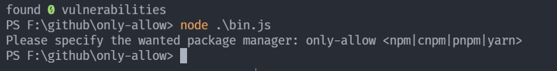
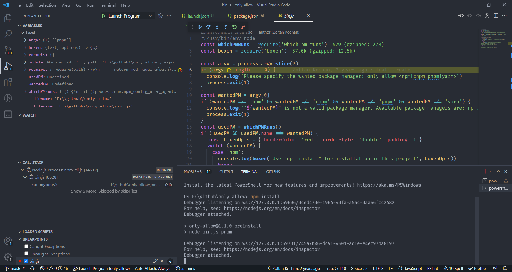
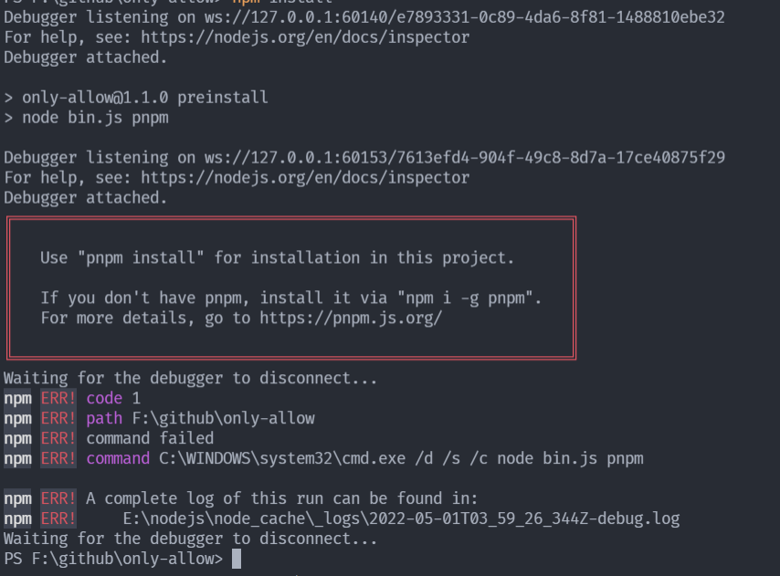

---
nav:
  title: 读源码
  order: 8
group:
  title: 源码系列
  order: 1
title: only allow
order: 5
---

# Only-allow 解读

## 前言

在`vue3`中的`package.json`中有`preintstall`的命令，这是一个生命周期钩子。会在你执行`npm`前进行调用。更多的生命周期函数，请点击[life-cycle-scripts](https://docs.npmjs.com/cli/v6/using-npm/scripts#life-cycle-scripts)

```json
{
  // ...
  "scripts": {
    "preinstall": "node ./scripts/preinstall.js"
  }
}
```

我们看看相关的代码

```js
if (!/pnpm/.test(process.env.npm_execpath || '')) {
  console.warn(
    `\u001b[33mThis repository requires using pnpm as the package manager ` +
      ` for scripts to work properly.\u001b[39m\n`
  )
  process.exit(1)
}
```

这里相当于只允许我们使用`pnpm`做包管理工具，实现了一个最为简单的包管理限制。

但这样的复用性不高。我们可以看看`vite`源码中是如何做的。

```json
{
  // ...
  "scripts": {
    "preinstall": "npx only-allow pnpm"
  }
}
```

我们看到这里使用了`only-allow`包，我们也看看`npx`。关于`npx`的使用，可以看看[npx使用](https://www.npmjs.com/package/npx)。

我们接下来就来分析下`only-allow`.

## 调试源码

我们先克隆和安装相关依赖

```shell
git clone https://github.com/pnpm/only-allow

npm install
```

我们运行下方的命令

```shell
node ./bin.js 
```



接着我们使用vscode配置好调试环境



然后我们就可以愉快的调试`bin.js`了。

我们输入`npm install`,得到下面的提示，由于我们使用了`npm`,但是要求的是`pnpm`。

所以下方会提示报错。



## 源码分析

### `Only-Allow`

```js
#!/usr/bin/env node
// 查询当前包管理工具
const whichPMRuns = require('which-pm-runs')
// 输出友好提示
const boxen = require('boxen')

// 取参数
const argv = process.argv.slice(2)
if (argv.length === 0) {
  console.log('Please specify the wanted package manager: only-allow <npm|cnpm|pnpm|yarn>')
  process.exit(1)
}

// 预期的npm
const wantedPM = argv[0]
if (wantedPM !== 'npm' && wantedPM !== 'cnpm' && wantedPM !== 'pnpm' && wantedPM !== 'yarn') {
  console.log(`"${wantedPM}" is not a valid package manager. Available package managers are: npm, cnpm, pnpm, or yarn.`)
  process.exit(1)
}
const usedPM = whichPMRuns()
// 做对应判断
if (usedPM && usedPM.name !== wantedPM) {
  const boxenOpts = { borderColor: 'red', borderStyle: 'double', padding: 1 }
  switch (wantedPM) {
    case 'npm':
      console.log(boxen('Use "npm install" for installation in this project', boxenOpts))
      break
    case 'cnpm':
      console.log(boxen('Use "cnpm install" for installation in this project', boxenOpts))
      break
    case 'pnpm':
      console.log(boxen(`Use "pnpm install" for installation in this project.

If you don't have pnpm, install it via "npm i -g pnpm".
For more details, go to https://pnpm.js.org/`, boxenOpts))
      break
    case 'yarn':
      console.log(boxen(`Use "yarn" for installation in this project.

If you don't have Yarn, install it via "npm i -g yarn".
For more details, go to https://yarnpkg.com/`, boxenOpts))
      break
  }
  process.exit(1)
}

```

上面的代码也比较简单把。

`取参数 -> 判断执行环境  -> 输出`

这里用到了`which-npm-run`，我们也看一下。

### `which-npm-run`

源码地址: [which-npm-run](https://github.com/zkochan/packages/blob/master/which-pm-runs/index.js)

```js
'use strict'

module.exports = function () {
  if (!process.env.npm_config_user_agent) {
    return undefined
  }
  return pmFromUserAgent(process.env.npm_config_user_agent)
}

function pmFromUserAgent (userAgent) {
  const pmSpec = userAgent.split(' ')[0]
  const separatorPos = pmSpec.lastIndexOf('/')
  return {
    name: pmSpec.substr(0, separatorPos),
    version: pmSpec.substr(separatorPos + 1)
  }
}
```

判断`pm`的种类以及版本。

## 总结

这个工具并不复杂，但其实对于我们来说，十分常用，我们也通过了分析，去了解他的原理，实际上确实不复杂。

其实我们也可以思考，更多的时候我们如果去规范，我们的一个流程，让协作更加的有效。

这里我们使用了限制了`pm`的种类，那我们是否可以限制版本呢？也是可以的，这知识一个例子，我们可以根据我们的实际情况去大胆想象。

## 参考
- [从 vue3 和 vite 源码中，我学到了一行代码统一规范团队包管理器的神器](https://juejin.cn/post/7033560885050212389)
- [only allow](https://github.com/pnpm/only-allow)
- [which-npm-runs](https://github.com/zkochan/packages/blob/master/which-pm-runs)