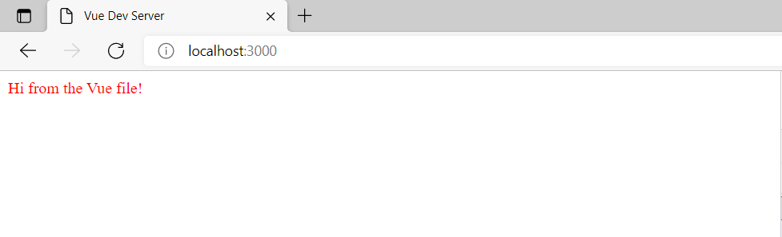
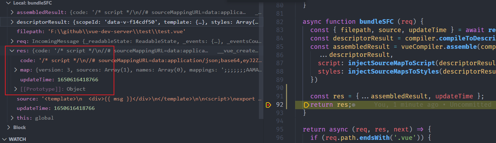
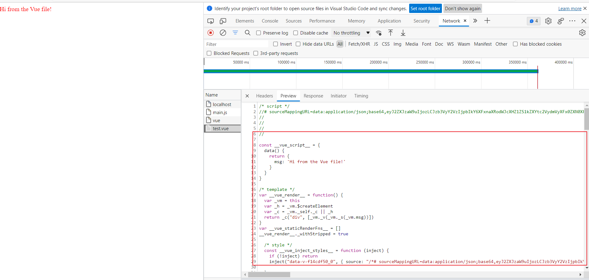
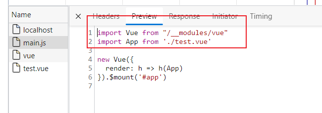

---
nav:
  title: 读源码
  order: 8
group:
  title: 源码系列
  order: 1
title: vue-dev-server
order: 3
---

# vue-dev-server

[vue-dev-server](https://github.com/vuejs/vue-dev-server)是尤大编写的一个小工具，可以让你在开发环境下，无需打包，就能使用Vue单文件。

源码一共也就百来行，很适合学习。

下面我们来具体分析一下吧。

## 是什么

从仓库中的[`README`](https://github.com/vuejs/vue-dev-server)我们可以看到下面这段话。

> This is a proof of concept.
>
> Imagine you can import Vue single-file components natively in your browser... without a build step.

类似于下方的代码一样。

```html
<div id="app"></div>
<script type="module">
import Vue from 'https://unpkg.com/vue/dist/vue.esm.browser.js'
import App from './App.vue'

new Vue({
  render: h => h(App)
}).$mount('#app')
</script>
```

`App.vue`:
```vue
<template>
  <div>{{ msg }}</div>
</template>

<script>
export default {
  data() {
    return {
      msg: 'Hi from the Vue file!'
    }
  }
}
</script>

<style scoped>
div {
  color: red;
}
</style>
```

## 基本原理

- 游览器请求导入作为`ESM`导入，没有打包过程。

- 服务器会拦截`.vue`文件，进行编译，并返回`JavaScript`。

- 如果提供了`ES`模块的库，只需从CDN进行引入。

- 导入到`.js`文件的包，会重写到本地的文件，目前，仅支持`vue`。

## 效果

我们可以直接在游览器中引入`vue`文件，并且没有打包过程的概念。

我们来看一下实际的效果吧，找到`package.json`。

```json
{
  "name": "@vue/dev-server",
  "version": "0.1.1",
  "description": "Instant dev server for Vue single file components",
  "main": "middleware.js",
  "bin": {
    "vue-dev-server": "./bin/vue-dev-server.js"
  },
  "scripts": {
    "test": "cd test && node ../bin/vue-dev-server.js"
  },
  "author": "Evan You",
  "license": "MIT",
  "dependencies": {
    "@vue/component-compiler": "^3.6.0",
    "express": "^4.16.4",
    "lru-cache": "^5.1.1",
    "recast": "^0.17.3",
    "validate-npm-package-name": "^3.0.0",
    "vue": "^2.6.8",
    "vue-template-compiler": "^2.6.8"
  }
}
```

1. 安装依赖
```shell
npm install
```

2. 找到`script`这里，运行命令
```shell
cd test && node ../bin/vue-dev-server.js
```

我们可以看到服务启动，我们将启动的地址用浏览器打开：



那接下来，我们就来分析这个流程。

## 分析

我们首先从`package.json`的命名可以看出，运行了`bin`下的`vue-dev-server`

```js
#!/usr/bin/env node

const express = require('express')
const { vueMiddleware } = require('../middleware')

const app = express()
const root = process.cwd();

// 中间件 这是处理文件的核心
app.use(vueMiddleware())

app.use(express.static(root))

app.listen(3000, () => {
  console.log('server running at http://localhost:3000')
})
```

可以看到这里使用了[`express`](https://github.com/expressjs/express)，搭建了服务端环境。

同时，我们看到`process.cwd`，由于我们运行`npm run test`的时候，来到了`test`目录，所以这里就是`root`是`test`目录。

我们的服务`http://localhost:3000`会打到`test`的`index.html`中。

接着，我们可以看到`vueMiddleware`这个中间件，这个是核心，对请求进行拦截，然后对具体请求的文件进行解析返回。后面再详细讲解。

大概的流程如下所示。

1. `client`请求`server`
2. `server`将请求会经过中间件。
3. `Middleware`会根据文件类型进行解析并响应。

.png)

上方其实就是`vue-dev-server`的简单流程了，实质上是`拦截请求`，`并根据特定的文件类型进行响应`。

其实上方中最为重要的就是`vueMiddleware`这一层。

## vueMiddleware

我们来看核心部分

```js
const vueMiddleware = (options = defaultOptions) => {
  
  // some code

  return async (req, res, next) => {
    if (req.path.endsWith('.vue')) {      
      // handle .vue file
      send(res, out.code, 'application/javascript')
    } else if (req.path.endsWith('.js')) {
      // handle js
      send(res, out, 'application/javascript')
    } else if (req.path.startsWith('/__modules/')) {
      // handle package
      send(res, out, 'application/javascript')
    } else {
      // handle else
      next()
    }
  }
}
```

实质上，所有的请求都会经过`vueMiddleware`，去对不同的文件类型进行处理
我们来具体看看。

### vue文件类型处理
```js
if (req.path.endsWith('.vue')) {      
  // 拿到请求的path 生成key
  const key = parseUrl(req).pathname
  // 查看是否有缓存
  let out = await tryCache(key)

  // 没有缓存，则生成
  if (!out) {
    // Bundle Single-File Component 借用了@vue/component-compiler的能力
    const result = await bundleSFC(req)
    out = result
    cacheData(key, out, result.updateTime)
  }
  // 返回
  send(res, out.code, 'application/javascript')
}
```
这个过程的逻辑也不复杂，根据请求路径生成对应的`key`,根据`key`去找是否有对应的缓存，没有则生成，并返回。这里的`cacheData`和`bundleSFC`具体看看逻辑。

#### cacheData

实质上就是根据`key`,`value`对数据的缓存。

```js
let cache
let time = {}
if (options.cache) {
  const LRU = require('lru-cache')

  cache = new LRU({
    max: 500,
    length: function (n, key) { return n * 2 + key.length }
  })
}

function cacheData (key, data, updateTime) {
  const old = cache.peek(key)

  if (old != data) {
    cache.set(key, data)
    if (updateTime) time[key] = updateTime
    return true
  } else return false
}
```

#### bundleSFC

>  由于笔者对`@vue/component-compiler`不熟悉，对具体的编译过程就不做解释了，感兴趣的小伙伴，可以了解一下。

这部分实质上就是根据`vueCompiler`去编译文件，去生成数据，其中包括`code`，我们可以调试看看。

```js
const compiler = vueCompiler.createDefaultCompiler()

async function readSource(req) {
  const { pathname } = parseUrl(req)
  const filepath = path.resolve(root, pathname.replace(/^\//, ''))
  return {
    filepath,
    source: await readFile(filepath, 'utf-8'),
    updateTime: (await stat(filepath)).mtime.getTime()
  }
}

async function bundleSFC (req) {
  const { filepath, source, updateTime } = await readSource(req)
  const descriptorResult = compiler.compileToDescriptor(filepath, source)
  const assembledResult = vueCompiler.assemble(compiler, filepath, {
    ...descriptorResult,
    script: injectSourceMapToScript(descriptorResult.script),
    styles: injectSourceMapsToStyles(descriptorResult.styles)
  })
  return { ...assembledResult, updateTime }
}
```

调试结合如下，我们发现，我们生成`code`,`map`,`updateTime`等信息。



注意，这里的`code`其实就是`vue`文件编译后的`js`代码。我们直接把这行代码进行返回即可。

```js
send(res, out.code, 'application/javascript')
```

看看案例中的请求`test.vue`的效果。



以上，就是加载`vue`文件的处理逻辑.

### js文件类型处理

我们接下来看看`js`的处理逻辑。

```js
if() {
  // some code
} else if (req.path.endsWith('.js')) {
  const key = parseUrl(req).pathname
  let out = await tryCache(key)

  if (!out) {
    // transform import statements
    const result = await readSource(req)
    out = transformModuleImports(result.source)
    cacheData(key, out, result.updateTime)
  }

  send(res, out, 'application/javascript')
}
```
这段逻辑也比较易读,也是找文件的缓存，没有则再生成。

这里我们着重看一下`transformModuleImports`这个函数逻辑。

```js
function transformModuleImports(code) {
  const ast = recast.parse(code)
  recast.types.visit(ast, {
    visitImportDeclaration(path) {
      const source = path.node.source.value
      if (!/^\.\/?/.test(source) && isPkg(source)) {
        path.node.source = recast.types.builders.literal(`/__modules/${source}`)
      }
      this.traverse(path)
    }
  })
  return recast.print(ast).code
}
```

关于[`recast`](https://github.com/benjamn/recast)，个人理解也是一个类`babel`的转译器。
这里的作用应该是将引入语句进行转换
```ts
// before
import Vue from 'vue';

// after
import Vue from '/__modules/vue';
```
看看测试中的例子

首页在请求`main.js`时候，`main.js`的响应。

`main.js`文件
```js
import Vue from 'vue'
import App from './test.vue'

new Vue({
  render: h => h(App)
}).$mount('#app')
```

而经过`recast`转译,得到图下结果



### 对`/__modules/`开头的文件进行处理

```js
if (req.path.startsWith('/__modules/')) {
  const key = parseUrl(req).pathname
  const pkg = req.path.replace(/^\/__modules\//, '')

  let out = await tryCache(key, false) // Do not outdate modules
  if (!out) {
    out = (await loadPkg(pkg)).toString()
    cacheData(key, out, false) // Do not outdate modules
  }

  send(res, out, 'application/javascript')
}
```

这里我们着重看看`loadPkg`。

```js
async function loadPkg(pkg) {
  if (pkg === 'vue') {
    const dir = path.dirname(require.resolve('vue'))
    const filepath = path.join(dir, 'vue.esm.browser.js')
    return readFile(filepath)
  }
  else {
    // TODO
    // check if the package has a browser es module that can be used
    // otherwise bundle it with rollup on the fly?
    throw new Error('npm imports support are not ready yet.')
  }
}
```

这里目前仅对`vue`做了处理，没错，这里其他的`npm`包都会报错。
因为下方需要检测`npm`是否支持`esModule`。（这个逻辑有点难判断）。

## 总结

我们这里分析了[vue-dev-server](https://github.com/vuejs/vue-dev-server)的基本流程和原理，这里有很多东西值得我们学习。

- 充分利用缓存
- 利用编译工具做代码转译
- 中间件对请求类型专门的处理

等等，以上的思路其实都是非常不错的。

思考，我们后续能做啥呢

- 完善`loadPkg`的逻辑
- 不同文件的引入, 如`jsx`, `tsx`甚至你也可以自定义。(处理好解析层即可)
- 等等......

## 参考

- [尤雨溪几年前开发的“玩具 vite”，才100多行代码，却十分有助于理解 vite 原理](https://juejin.cn/post/7021306258057592862)
- [source code](https://github.com/vuejs/vue-dev-server)