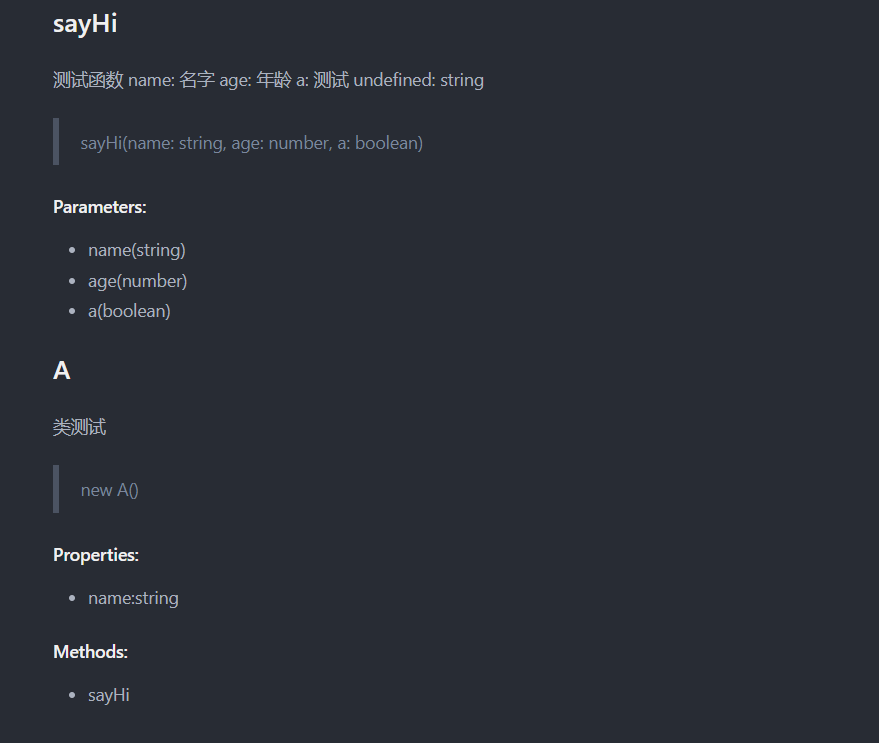

---
nav:
  title: babel
  order: 7
group:
  title: 案例
  order: 2
title: 自动生成API文档
order: 4
---

# 实战案例：自动生成API文档

接下来，这一章会讲述如何通过函数注释去生成`api`文档。

## 思路分析

比如下方的代码：

```ts
function sayHi (name: string, age: number, a: boolean) {
  console.log(`hi ${name}`);
  return `hi, name`;
}

class A {
  name: string;

  constructor(name: string) {
    this.name = name;
  }

  sayHi(): string {
    return `hi, I'm ${this.name}`;
  }
}
```

所以我们需要处理`FunctionDeclaration`以及`ClassDeclaration`节点：

我们先来分析一下我们需要的节点的数据结构。

### FunctionDeclaration

```json
{
  "type": "function",
  "name": "funName",
  "params": [],
  "returnType": "number",
  "doc": "xxxx"
}
```

### ClassDeclaration

`ClassDeclaration`的处理复杂一点，需要提取`constructor`、`method`、`properties`的信息。

```json
{
  "type": "class",
  "name": "xxx",
  "constructorInfo": {},
  "methodsInfo": [],
  "propertiesInfo": [],
  "doc": ""
}
```

我们去遍历节点收集信息即可。

### 文档生成

当我们收集足够的信息，我们去编写相关的`render`函数，就可以实现我们的需求了。

流程类似下方思路

```ts
function render(docs: info[], format: string) {
  let str = '';
  // return str by format type;
  return str;
}

function generateJsonStr(docs: info) {
  // generate json str
}

function generateMdStr(docs: info[]) {
  // generate md str
}
```

## 具体实现

### 遍历普通函数

```js
FunctionDeclaration(path, state) {
  const docs = state.file.get('docs');
  docs.push({
    type: 'function',
    name: path.node.id.name,
    params: path.get('params').map(paramPath => {
        return {
          name: paramPath.toString(),
          type: resolveType(paramPath.getTypeAnnotation().typeAnnotation.type)
        };
      }),
    return: resolveType(path.get('returnType').getTypeAnnotation().type),
    doc: path.node.leadingComments && parseComment(path.node.leadingComments[0].value),
  });
  state.file.set('docs', docs);
},
```

### 遍历类
```js
ClassDeclaration (path, state) {
  const docs = state.file.get('docs');
  const classInfo = {
    type: 'class',
    name: path.get('id').toString(), 
    constructorInfo: {},
    methodsInfo: [],
    propertiesInfo: []
  };
  if (path.node.leadingComments) {
    classInfo.doc = path.node.leadingComments[0] ? parseComment(path.node.leadingComments[0].value) : undefined;
  }
  docs.push(classInfo);
  state.file.set('docs', docs);
  path.traverse({
    ClassProperty(path) {
      classInfo.propertiesInfo.push({
        name: path.get('key').toString(),
        type: resolveType(path.getTypeAnnotation().typeAnnotation.type),
        doc: [path.node.leadingComments, path.node.trailingComments].filter(Boolean).map(comment => {
            return parseComment(comment.value);
        }).filter(Boolean)
      })
    },
    ClassMethod(path) {
      if (path.node.kind === 'constructor') {
        classInfo.constructorInfo = {
          params: path.get('params').map(paramPath=> {
          return {
            name: paramPath.toString(),
            type: resolveType(paramPath.getTypeAnnotation().typeAnnotation.type),
            doc: path.node.leadingComments && path.node.leadingComments[0] && parseComment(path.node.leadingComments[0].value)
          }
        })
      }
    } else {
        classInfo.methodsInfo.push({
          name: path.get('key').toString(),
          doc: parseComment(path.node.leadingComments[0].value),
          params: path.get('params').map(paramPath=> {
            return {
              name: paramPath.toString(),
              type: resolveType(paramPath.getTypeAnnotation().typeAnnotation.type)
            }
          }),
          return: resolveType(path.get('returnType').getTypeAnnotation().type)
        })
      }
    }
  });
  state.file.set('docs', docs);
}
```

### 生成文档

```js
const formatExtMap = {
  json: 'json',
  markdown: 'md',
}

function generate(docs, format = 'json') {
  return {
    ext: formatExtMap[format],
    content: render[format](docs)
  }
}

// render 函数
function generateMdFile(docs) {
  let str = "";

  docs.forEach((doc) => {
    if (doc.type === "function") {
      str += "## " + doc.name + "\n";
      str += doc.doc.description + "\n";
      if (doc.doc.tags) {
        doc.doc.tags.forEach((tag) => {
          str += tag.name + ": " + tag.description + "\n";
        });
      }
      str += ">" + doc.name + "(";
      if (doc.params) {
        str += doc.params
          .map((param) => {
            return param.name + ": " + param.type;
          })
          .join(", ");
      }
      str += ")\n";
      str += "#### Parameters:\n";
      if (doc.params) {
        str += doc.params
          .map((param) => {
            return "- " + param.name + "(" + param.type + ")";
          })
          .join("\n");
      }
      str += "\n";
    } else if (doc.type === "class") {
      str += "## " + doc.name + "\n";
      str += doc.doc.description + "\n";
      if (doc.doc.tags) {
        doc.doc.tags.forEach((tag) => {
          str += tag.name + ": " + tag.description + "\n";
        });
      }
      str += "> new " + doc.name + "(";
      if (doc.params) {
        str += doc.params
          .map((param) => {
            return param.name + ": " + param.type;
          })
          .join(", ");
      }
      str += ")\n";
      str += "#### Properties:\n";
      if (doc.propertiesInfo) {
        doc.propertiesInfo.forEach((param) => {
          str += "- " + param.name + ":" + param.type + "\n";
        });
      }
      str += "#### Methods:\n";
      if (doc.methodsInfo) {
        doc.methodsInfo.forEach((param) => {
          str += "- " + param.name + "\n";
        });
      }
      str += "\n";
    }
    str += "\n";
  });
  return str;
}

const render = {
  json(docs) {
    return JSON.stringify(docs, null, 2);
  },
  markdown(docs) {
    return generateMdFile(docs);
  }
};

module.exports = {
  render,
};
```

## 效果

### Input
```ts
/**
 * 测试函数
 * @param name 名字
 * @param age 年龄
 * @param a 测试
 * @returns string
 */
function sayHi (name: string, age: number, a: boolean): string {
  console.log(`hi ${name}`);
  return `hi, name`;
}

/**
 * 类测试
 */
class A {
  name: string;

  constructor(name: string) {
    this.name = name;
  }

  /**
   * 方法测试
   */
  sayHi(): string {
    return `hi, I'm ${this.name}`;
  }
}
```

### output
```md
## sayHi
测试函数
name: 名字
age: 年龄
a: 测试
undefined: string
>sayHi(name: string, age: number, a: boolean)
#### Parameters:
- name(string)
- age(number)
- a(boolean)

## A
类测试
> new A()
#### Properties:
- name:string
#### Methods:
- sayHi

```

### 文件效果



## 总结

上面我们实现了`api` -> `docs`的生成，其实核心步骤就是两步,`收集文档的元信息`以及`render函数的实现`。你完全可以自定义数据结构，以及渲染函数，实现自己的`api` -> `docs`。

## 参考
- [Babel 插件通关秘籍](https://juejin.cn/book/6946117847848321055/section/6951617020198813733)
- [source code]()