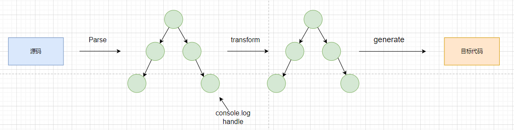
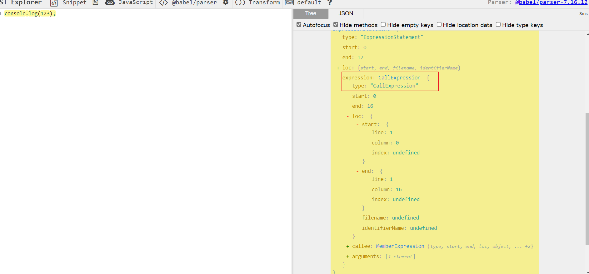
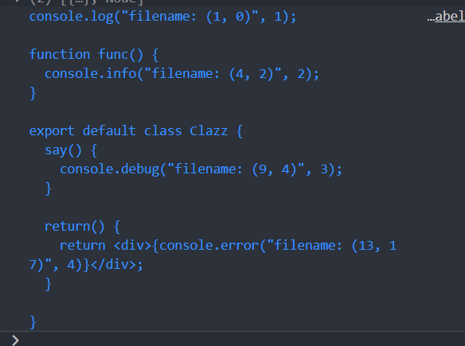

---
nav:
  title: babel
  order: 7
group:
  title: 案例
  order: 2
title: 插入函数调用参数
order: 2
---

# 插入函数调用参数

这里我们简单的实现插入函数的功能。

## 需求描述

> 我们很多时候会调用`console`的代码方便我们进行相关调试，我们需要借助`babel`赖实现行、列名的参数。

### 思路分析



根据上面的思路，其实我们可以看到，我们只要在`transform`将我们的`console`的相关节点自动插入相关参数即可。

即通过`transform`中`visitor`对指定的函数表达式做处理，我们看一下`console.log`的节点数据结构。



从上图，我们可以分析他的`callee`和`arguments`去进行处理即可。

### 代码实现

首先，我们先搭建基本的流程

```js
const parser = require('@babel/parser');
const traverse = require('@babel/traverse').default;
const generate = require('@babel/generator').default;
const fs = require('fs');
const path = require('path');

const sourceCode = fs.readFileSync(path.join(__dirname, './sourceCode.js'), {
  encoding: 'utf-8'
});

// parse
const ast = parser.parse(sourceCode, {
  sourceType: 'unambiguous',
  plugins: ['jsx']
});

// transform
traverse(ast, {
  CallExpression (path, state) {
    console.log(path);
  }
});

// generate code
const { code } = generate(ast);
console.log(code);
```

然后，我们对`transform`的逻辑进行细化。

```js
// transform
traverse(ast, {
  CallExpression (path, state) {
    const { loc, callee, arguments } = path.node;
    if (checkConsoleFn(callee)) {
      const { line, column } = loc.start;
      arguments.unshift(types.stringLiteral(`filename: (${line}, ${column})`));
      console.log(arguments);
    }
  }
});
```



上方也符合我们的预期。

## 需求变更

> 后面我们将需求改为在`console.xx`节点前打印。

### 思路分析

这个需求的难点在于，我们如何在当前的`console`的`AST`插入一个新的`AST`,对于这种复杂的`AST`,我们使用`@babel/template`的包。

### 代码实现

插入`AST`我们可以使用`path.insertBefore`的`api`,替换可以用`path.replaceWith`,同时`replace`的新节点我们可以用`path.skip`跳过。

```js
traverse(ast, {
  CallExpression (path, state) {
    const { loc, callee } = path.node;
    if (!loc) { 
      return;
    }
    if (checkConsoleFn(callee)) {
      const { line, column } = loc.start;
      const newNode = template.expression(`console.log('filename: ${line}, ${column}')`)();
      if (path.findParent(path => path.isJSXElement())) {
        path.replaceWith(types.arrayExpression([newNode, path.node]));
        path.skip();
      } else {
        path.insertBefore(newNode);
      }
    }
  }
});
```

## 改造成插件

```ts
const checkConsoleFn = (callee) => {
  return callee.object.name === 'console' && ['log', 'info', 'error', 'debug'].includes(callee.property.name);
};

const parametersInsertPlugin = ({ types, template }, options, dirname) => {
  return {
    visitor: {
      CallExpression (path, state) {
        const { loc, callee } = path.node;
        if (!loc) { 
          return;
        }
        if (checkConsoleFn(callee)) {
          const { line, column } = loc.start;
          const newNode = template.expression(`console.log('filename: ${line}, ${column}')`)();
          if (path.findParent(path => path.isJSXElement())) {
            path.replaceWith(types.arrayExpression([newNode, path.node]));
            path.skip();
          } else {
            path.insertBefore(newNode);
          }
        }
      }
    }
  }
}

module.exports = parametersInsertPlugin;
```

使用插件

```js
const { transformFileSync } = require('@babel/core');
const insertParametersPlugin = require('./plugins/parameters-insert-plugin');
const path = require('path');

const { code } = transformFileSync(path.join(__dirname, './sourceCode.js'), {
  plugins: [insertParametersPlugin],
  parserOpts: {
    sourceType: 'unambiguous',
    plugins: ['jsx']       
  }
});

console.log(code);
```

我们的一个插件就完成了。

## 补充

### auto-console-remove

仅仅是把对应得到节点信息进行`remove`。

```js
const targetCalleeNames = ['log', 'info', 'error', 'debug'];

const checkConsole = (node) => {
  return (node.callee.object.name === 'console') && ( targetCalleeNames.includes(node.callee.property.name)); 
}

const parametersInsertPlugin = ({ types, template }, options, dirname) => {
  return {
    visitor: {
      CallExpression(path, state) {
        const node = path.node;
        if (checkConsole(node)) {
          path.remove();
        }
      }
    }
  }
}

module.exports = parametersInsertPlugin;
```

## 总结

我们通过了一个案例，接触了以下知识点。

- `babel`编译流程。
- `visitor`对节点的处理。
- `babel` 插件的编写。

## 参考

- [Babel 插件通关秘籍](https://juejin.cn/book/6946117847848321055)