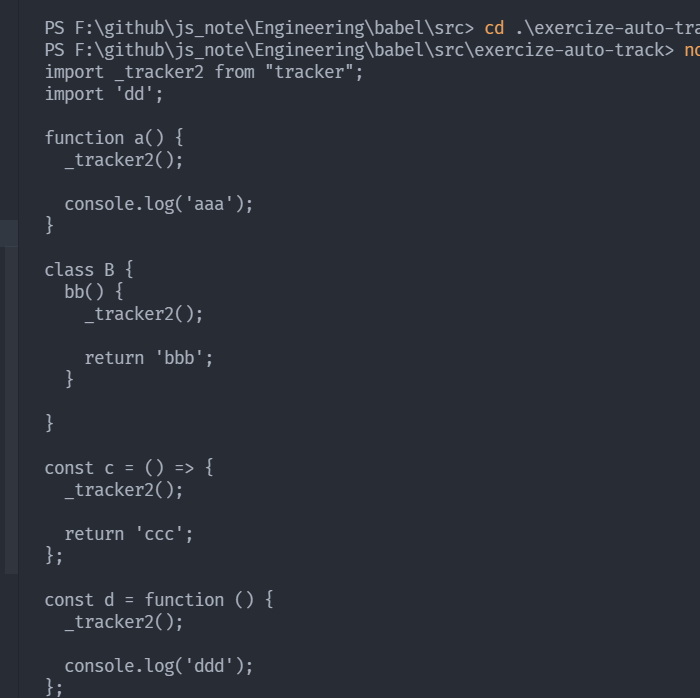

---
nav:
  title: babel
  order: 7
group:
  title: 案例
  order: 2
title: 自动埋点
order: 1
---

# 自动埋点

埋点是一个比较常见面的需求，就像是函数中需要上报一些信息。想一些性能买点，每个函数，都要处理，很繁琐。能不能实现自动埋点呢？

注意，埋点只是在函数中增加一段代码。不影响其他逻辑，即函数插桩。

下面我们用`babel`来实现自动埋点。

## 分析

比如下方的代码

```js
import aa from 'aa';
import * as bb from 'bb';
import { cc } from 'cc';
import dd from 'dd';

function a() {
  console.log('aaa');
}

class B {
  bb() {
    return 'bbb';
  }
}

const c = () => 'ccc';

const d = function () {
  console.log('ddd');
}
```

我们需要最后的一个埋点是这样的

```js
import _tracker2 from "tracker";
import 'dd';

function a() {
  _tracker2();

  console.log('aaa');
}

class B {
  bb() {
    _tracker2();

    return 'bbb';
  }

}

const c = () => {
  _tracker2();

  return 'ccc';
};

const d = function () {
  _tracker2();

  console.log('ddd');
};
```

上面，我们有两段逻辑，需要处理。
- `tracker`模块的引入。
- 对所有的函数开始插入`tracker`代码

## 代码实现

### 模块引入

引入模块这个功能，其实是很多插件都需要的，我们这里用[`@babel/helper-module-imports`](https://babeljs.io/docs/en/babel-helper-module-imports)（可以点击进去看看）

基本用法
```js
import { addDefault } from "@babel/helper-module-imports";
addDefault(path, 'source');
```

我们用得到下面的代码
```js
import _default from 'source';
```

#### 执行流程
1. 判断程序中有没有引入相关的函数，有的话，则无需再引入。
2. 没有引入则编码引入。

具体： 在`Program`中使用`path.traverse`来遍历`ImportDeclaration`，如果引入了模块，就记录`id`到`state`,并用`path.stop`来终止遍历；没有的话就引入`tracker`模块，用`generateUid`生成唯一的`id`,然后放在`state`下。

我们将`tracker`的函数通过参数传入，通过`options`来传递。

```js
Program: {
  enter(path, state) {
    path.traverse({
      ImportDeclaration(curPath) {
        const requirePath = curPath.get('source').node.value;
        if (requirePath === options.trackerPath) {
          const specifierPath = curPath.get('specifiers.0');
        
          if (specifierPath.isImportSpecifier()) {
            state.trackerImportId = specifierPath.toString();
          } else if (specifierPath.isImportNamespaceSpecifier()) {
            state.trackerImportId = specifierPath.get('local').toString();
          }
          path.stop();
        }  
      }
  });
  if (!state.trackerImportId) {
    state.trackerImportId = importModule.addDefault(path, 'tracker', {
      nameHint: path.scope.generateUid('tracker'),
    }).name;
    state.trackerAST = api.template.statement(`${state.trackerImportId}()`)();
  }
}
```

注意，不同的`import`引入方式会产生不同的`AST`，要注意区分。

### 函数插桩

在这里，我们需要找到所有的函数，这里有`ClassMethod`、`ArrowFunctionExpression`、`FunctionExpression`、`FunctionDeclaration` 这些节点。

当然有的函数没有函数体，这种要包装一下，然后修改下 `return` 值。如果有函数体，就直接在开始插入就行了。

```js
'ClassMethod|ArrowFunctionExpression|FunctionExpression|FunctionDeclaration'(path, state) {
  const bodyPath = path.get('body');
  if (bodyPath.isBlockStatement()) {
    bodyPath.node.body.unshift(state.trackerAST);
  } else {
    const ast = api.template.statement(`{${state.trackerImportId}(); return PREV_BODY;}`)({PREV_BODY: bodyPath.node});
    bodyPath.replaceWith(ast);
  }
}
```

这样就实现了自动埋点。

## 效果演示

```js
const { transformFromAstSync } = require('@babel/core');
const parser = require('@babel/parser');
const autoTrackPlugin = require('./plugin/auto-track-plugin');
const fs = require('fs');
const path = require('path');

const sourceCode = fs.readFileSync(path.join(__dirname, './sourceCode.js'), {
  encoding: 'utf-8'
});

const ast = parser.parse(sourceCode, {
  sourceType: 'unambiguous'
});

const { code } = transformFromAstSync(ast, sourceCode, {
  plugins: [[ autoTrackPlugin, {
    trackerPath: 'tracker'
  }]]
});

console.log(code);
```



## 总结

上面我们使用了`babel`完成函数插桩。
思路分为`导入模块`和`插入函数`两部分。

## 参考

- [Babel](https://juejin.cn/book/6946117847848321055/section/6966211099620278272)