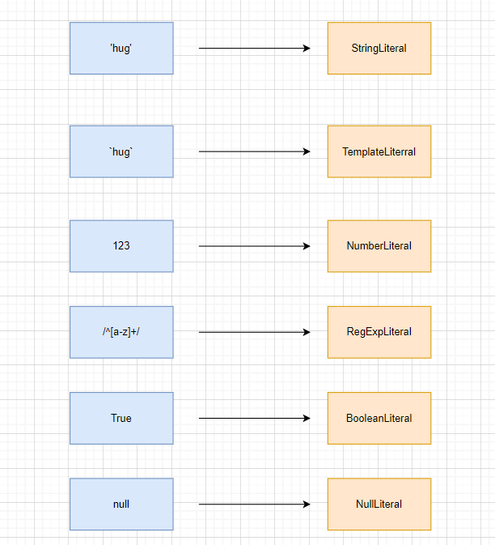
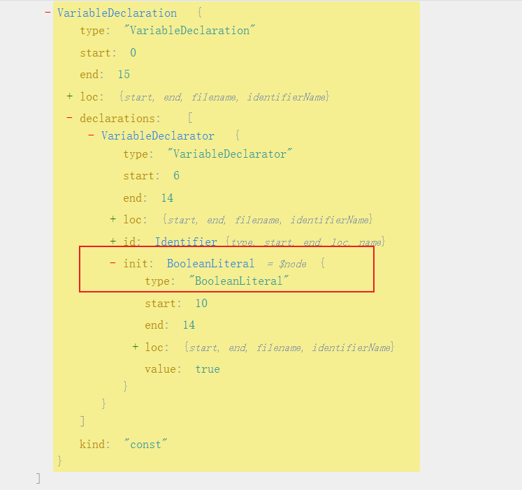
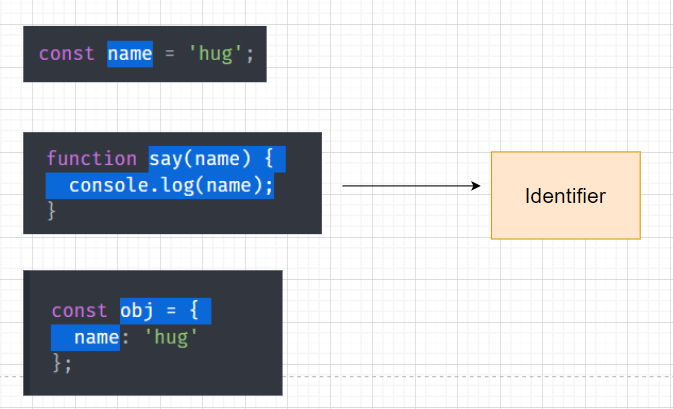
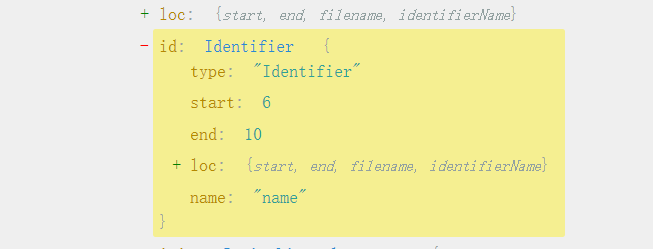
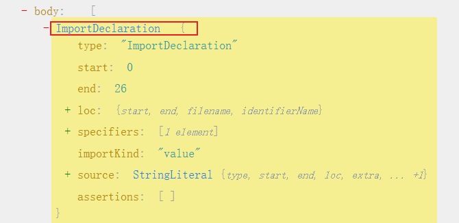
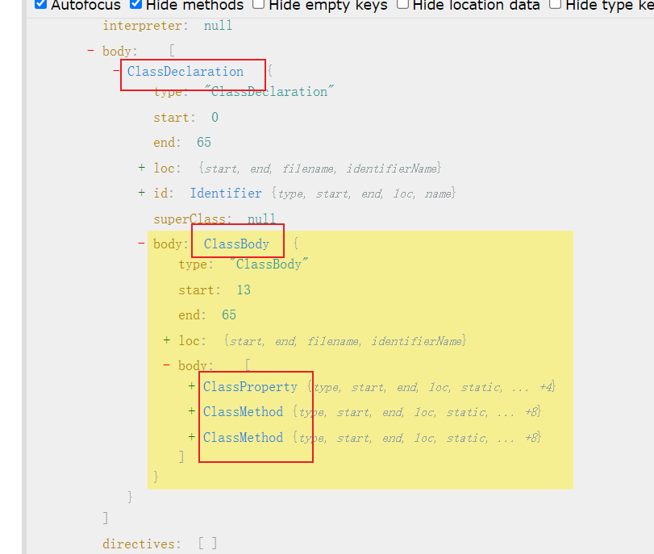
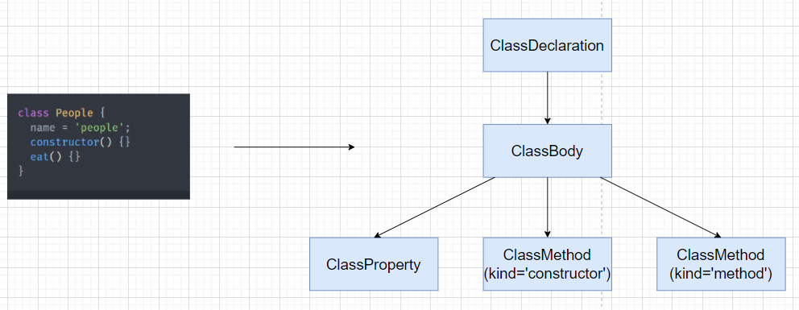
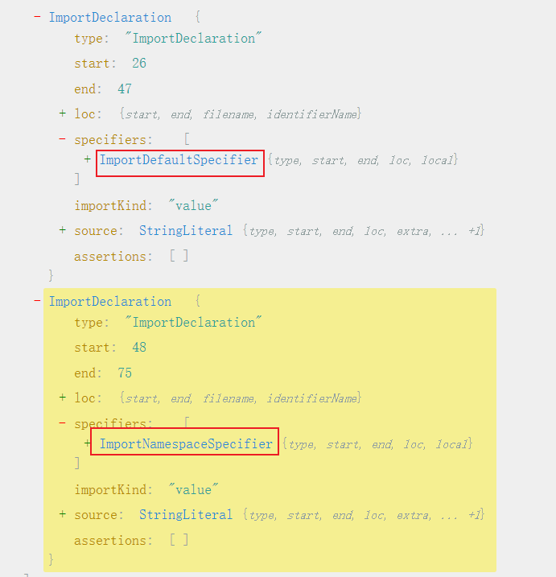

---
nav:
  title: Babel
  order: 7
group:
  title: 概况
  order: 1
title: Babel的AST
order: 3
---

# babel的AST

babel编译的第一步是将源码`parse`成抽象语法树AST(Abstract Syntax Tree),后续对这个AST进行转换。

AST是有标准的，JS parser的AST大多是es tree标准，从`SpiderMonkey`的AST标准扩展而来。babel的整个编译流程都是围绕着AST来的。

## 常见的AST节点

AST是对源码的抽象。字面量，表达式，声明，标识符，语句，模块，类都有自己的AST。

### Literal

Literal是字面量的意思，比如`let name = 'hug'`,其中`'hug'`就是一个StringLiteral,相应的还有数字字面量，布尔字面量，正则表达式字面量。





代码中的字面量很多，babel中是通过`xxLiteral`来抽象这部分内容。

### identifier

`identifier`是标识符的意思，变量名，属性名，参数名等各种声明和引用的名字，都是`identifier`。（你可以简单理解为各种变量）。

```js
const name = 'hug';

function say(name) {
  console.log(name);
}

const obj = {
  name: 'hug'
};
```
答案是这些






### Statement
statement是语句，可以独立执行的单位。比如 break、continue、debugger、return 或者 if 语句、while 语句、for 语句，还有声明语句，表达式语句等。我们写的每一条可以独立执行的代码都是语句。

语句末尾一般会加一个分号分隔，或者用换行分隔。

下面这些我们经常写的代码，每一行都是一个 Statement：
```js
break;
continue;
return;
debugger;
throw Error();
{}
try {} catch(e) {} finally{}
for (let key in obj) {}
for (let i = 0;i < 10;i ++) {}
while (true) {}
do {} while (true)
switch (v){case 1: break;default:;}
label: console.log();
with (a){}
```

语句是代码执行的最小单位，可以说，代码是由语句（Statement）构成的。

### Declaration

声明语句是一种特殊的语句。其中包括声明变量、函数、类、import、export。

比如下面这些声明语句：

```js
const a = 1;
function b(){}
class C {}

import d from 'e';

export default e = 1;
export {e};
export * from 'e';
```



### Expression
`expression` 是表达式，特点是执行完以后有返回值，这是和语句 (statement) 的区别。

下面是一些常见的表达式

```js
[1,2,3]
a = 1
1 + 2;
-1;
function(){};
() => {};
class{};
a;
this;
super;
a::b;
```
细心的同学可能会问 identifier 和 super 怎么也是表达式呢？

其实有的节点可能会是多种类型，identifier、super 有返回值，符合表达式的特点，所以也是 expression。

小结：表达式的特点是有返回值，有的表达式可以独立作为语句执行，会包裹一层 ExpressionStatement。

### Class

class 的语法也有专门的 AST 节点来表示。

整个 class 的内容是 ClassBody，属性是 ClassProperty，方法是ClassMethod（通过 kind 属性来区分是 constructor 还是 method）。

比如下面的代码

```js
class People {
  name = 'people';
  constructor() {}
  eat() {}
}
```

解析如下图。





class 是 es next 的语法，babel 中有专门的 AST 来表示它的内容。

### Modules

es module 是语法级别的模块规范，所以有专门的AST节点.

#### import

import的有三种语法

named import:
```js
import { c, d } from 'c';
```

default import
```js
import A from 'a';
```

namespaced import
```js
import * as b from 'b';
```

这 3 种语法都对应 ImportDeclaration 节点，但是 specifiers 属性不同，分别对应 ImportSpicifier、ImportDefaultSpecifier、ImportNamespaceSpcifier。



### export

export也有三种语法

name export:
```js
export { d, b } 
```

default export:
```js
export default a;
```

all export:
```js
export * from 'c';
```

分别对应 ExportNamedDeclaration、ExportDefaultDeclaration、ExportAllDeclaration 的节点

比如这三种 export

```js
export { b, d};
export default a;
export * from 'c';
```

### Program & Directive

program 是代表整个程序的节点，它有 body 属性代表程序体，存放 statement 数组，就是具体执行的语句的集合。还有 directives 属性，存放Directive 节点，比如"use strict" 这种指令会使用 Directive 节点表示。

Program 是包裹具体执行语句的节点，而 Directive 则是代码中的指令部分。

### File & Comment

babel 的 AST 最外层节点是 File，它有 program、comments、tokens 等属性，分别存放 Program 程序体、注释、token 等，是最外层节点。

注释分为块注释和行内注释，对应 CommentBlock 和 CommentLine 节点。

## AST 可视化查看工具
当然，我们并不需要记什么内容对应什么 AST 节点，可以通过 [ast explorer.net](https://astexplorer.net/) 这个网站来直观的查看。

## AST 的公共属性

每种 `AST` 都有自己的属性，但是它们也有一些公共属性：

- `type`： AST 节点的类型
- `start、end、loc`：start 和 end 代表该节点对应的源码字符串的开始和结束下标，不区分行列。而 loc 属性是一个对象，有 line 和 column 属性分别记录开始和结束行列号。
- `leadingComments、innerComments、trailingComments`： 表示开始的注释、中间的注释、结尾的注释，因为每个 AST 节点中都可能存在注释，而且可能在开始、中间、结束这三种位置，通过这三个属性来记录和 Comment 的关联。
- `extra`：记录一些额外的信息，用于处理一些特殊情况。比如 StringLiteral 修改 value 只是值的修改，而修改 extra.raw 则可以连同单双引号一起修改。

## 总结

这一节我们学习了代码中常见的语法在 babel 的 AST 中对应的节点。

我们学习了： 标识符 Identifer、各种字面量 xxLiteral、各种语句 xxStatement，各种声明语句 xxDeclaration，各种表达式 xxExpression，以及 Class、Modules、File、Program、Directive、Comment 这些 AST 节点。

了解了这些节点，就能知道平时写的代码是怎么用 AST 表示的，当然也不需要记，可以用 ( [ast explorer.net](https://astexplorer.net/)) 可视化的查看。

AST 节点可能同时有多种类型，确定一种 AST 节点是什么类型主要看它的特点，比如 Statement 的特点是可以单独执行，Expression 的特点是有返回值，所以一些可以单独执行的 Expression 会包一层 ExpressionStatement。

不同 AST 节点有不同的属性来存放各自对应的源码内容，但是都有一些公共属性如 type、xxComments、loc 等。

学会了 AST，就可以把对代码的操作转为对 AST 的操作了。

## 参考
- [Babel AST](https://juejin.cn/book/6946117847848321055/section/6946582409664004133)