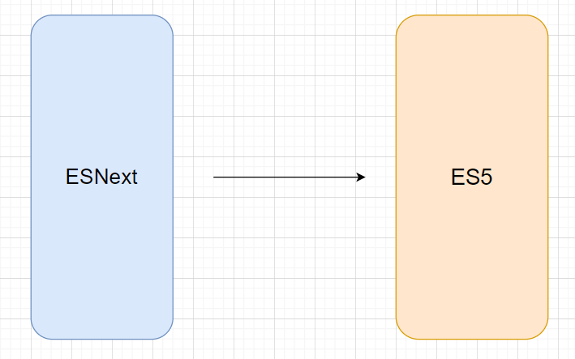
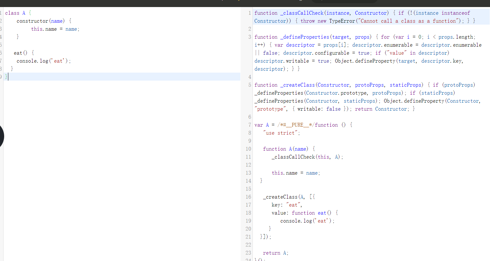

---
nav:
  title: babel
  order: 7
group:
  title: 概况
  order: 1
title: babel的内置功能
order: 9
---

# Babel的内置功能

babel最初的名字是`6 to 5`, 主要做得是`es6`到`es5`的转换和`polyfill`,后面改成了`babel`，主要的功能也是从高版本的`api`转成低版本的`api`并自动`polyfill`缺少的`api`。

babel 是怎么实现这些功能的呢？如果让我们基于插件机制实现 babel 内置的转换功能，该会如何设计呢？

## 从插件到`preset`

### 映射关系

要实现转换，第一步明确转换，两个集合，一个集合放置要转换的特性，另一个放置转换到的目标特性，两者建立一一映射关系。



#### 举个例子

**比如乘方运算符**

```js
let x = 10 ** 2;

x ** 3;
```

经过转译
```js
let x = Math.pow(x, 2);
x = Math,pow(x, 3);
```

实现的是`**` ---> `Math.pow`的转移。

**class**

class的话，我们一般用的是`function`、`prototype实现`



实现的是`class` -> `function prototype`的转换。

高版本代码到低版本代码，大多情况下都能直接转换，但并不是全面。涉及一些新型的`api`接口, 则不是转换语法，而是在环境中注入我们实现的`api`，也就是`polyfill`（垫片）。

通过`syntax transform`(语法转换)和`polyfill`,我们就能在目标环境中采用高版本的`js`语法和`api`。

### 需要转换的语言特性

babel 插件需要转换的特性包括 es 标准、proposal，还有 react、flow、typescript 等

#### es spec

我们知道，[TC39](https://link.juejin.cn/?target=https%3A%2F%2F262.ecma-international.org%2F) 是制定 javascript 语言标准的组织，每年都会公布加入到语言标准的特性，[es2015](https://link.juejin.cn/?target=https%3A%2F%2F262.ecma-international.org%2F6.0)、es2016、es2017 等。这些是我们要转换的语言特性范围。

在 babel6 时，分别用 preset-es2015、 preset-es2016 等来维护相应的 transform plugin，但在 babel7 的时候就改为 preset env 了。

#### proposal

babel 要转换的不只是加入标准的特性，语言特性从提出到标准会有一个过程，分为[几个阶段](https://link.juejin.cn/?target=https%3A%2F%2Ftc39.es%2Fprocess-document%2F)。

- 阶段 0 - Strawman: 只是一个想法，可能用 babel plugin 实现
- 阶段 1 - Proposal: 值得继续的建议
- 阶段 2 - Draft: 建立 spec
- 阶段 3 - Candidate: 完成 spec 并且在浏览器实现
- 阶段 4 - Finished: 会加入到下一年的 es20xx spec

这些还未加入到语言标准的特性也是要支持的。

babel6 的时候有 babel-state-x 的 preset，分别放不同阶段的特性，但是这个preset是变化的（每年都在变），比较难以维护，所以 babel7 以后就改成 plugin-proposal-xxx 了。


#### react、flow、typescript

只是转换 javascript 本身的 es spec 和 proposal 的特性特性并不够，现在我们开发的时候 jsx、typescript、flow 这些都是会用的，babel 肯定也得支持。

这些转换对应的 plugin 分别放在不同 preset 里： preset-jsx、preset-typescript、preset-flow。

我们要转换的范围又大了一些。


### 插件分类

上面是插件要转换的语言特性，babel7 内置的实现这些特性的插件分为 syntax、transform、proposal 3类。

#### syntax plugin

syntax plugin 只是在 parserOptions 中放入一个 flag 让 parser 知道要 parse 什么语法，最终的 parse 逻辑还是 babel parser（babylon） 实现的。

这些插件的目的就是让 parser 能够正确的解析对应的语法成 AST。

#### transform plugin

transform plugin 是对 AST 的转换，各种 es20xx 语言特性、typescript、jsx 等的转换都是在 transform plugin 里面实现的。

#### proposal plugin

未加入语言标准的特性的 AST 转换插件叫 proposal plugin，其实他也是 transform plugin，但是为了和标准特性区分，所以这样叫。

### preset

babel 的插件有很多，用于不同的目的需要不同的插件：

- 不同版本的语言标准支持： preset-es2015、preset-es2016 等，babel7 后用 preset-env 代替
- 未加入标准的语言特性的支持： 用于 stage0、stage1、stage2 的特性，babel7 后单独引入 proposal plugin
- 用于 react、jsx、flow 的支持：分别封装相应的插件为 preset-react、preset-jsx、preset-flow，直接使用对应 preset 即可

### helper

每个特性的实现用一个 babel 插件实现，当 babel 插件多了，自然会有一些共同的逻辑。这部分逻辑怎么共享呢？

babel 设计了插件之间共享逻辑的机制，就是 helper。

helper 分为两种：

- 一种是注入到 AST 的运行时用的全局函数
- 一种是操作 AST 的工具函数，比如变量提升这种通用逻辑

**总之，babel helpers 是用于 babel plugin 逻辑复用的一些工具函数，分为用于注入 runtime 代码的 helper 和用于简化 AST 操作 的 helper两种。第一种都在 @babel/helpers 包里，直接 this.addHelper(name) 就可以引入， 而第二种需要手动引入包和调用 api。**

### babel runtime

babel runtime 里面放运行时加载的模块，会被打包工具打包到产物中，下面放着各种需要在 runtime 使用的函数，包括三部分：regenerator、corejs、helper。

babel 做语法转换和 api 的 polyfill，需要自己实现一部分 runtime 的函数，就是 helper 部分，有的也没有自己实现，用的第三方的，比如 regenerator 是用的 facebook 的。api 的 polyfill 也是用的 core-js 的，babel 对它们做了整合。

## 总结

这一节我们了解了 babel 内置插件的分类（transform、proposal、syntax），然后介绍了 babel6 不同的 preset，之后了解了 babel 插件的复用代码的方式：helper。helper 分为用于 runtime 的 helper 和用于操作 AST 的helper。还有 babel runtime，这个包下的代码会被打包到产物中，运行时加载，包括 helper、regenerator、core-js 3部分。