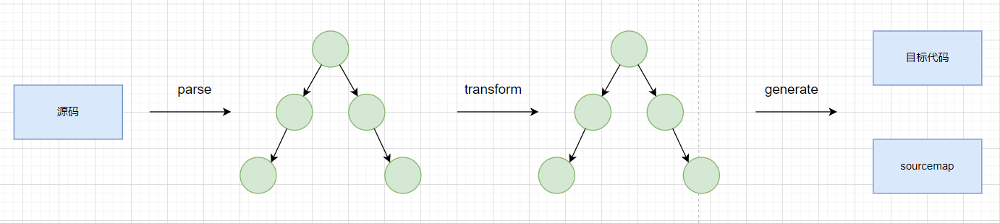
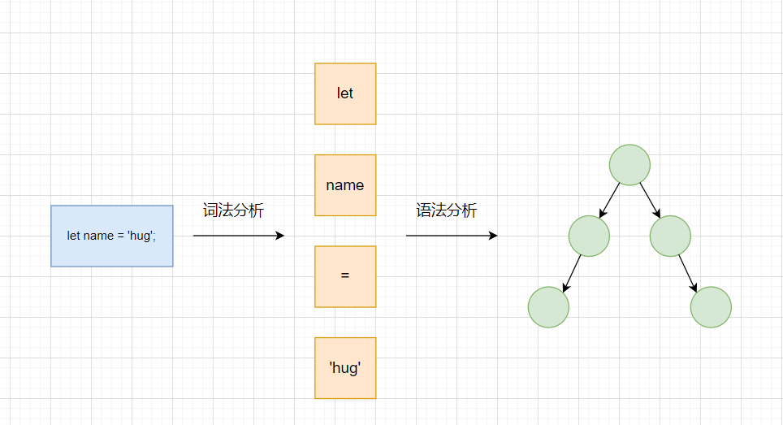
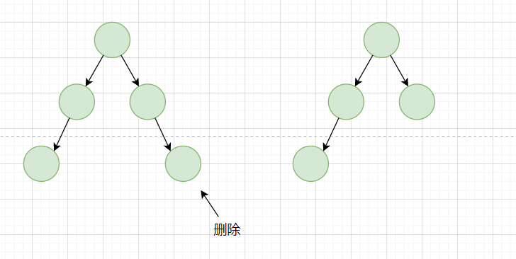
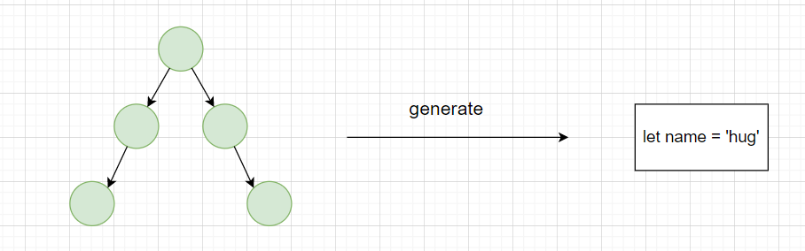

---
nav:
  title: Babel
  order: 7
group:
  title: 概况
  order: 1
title: 编译流程
order: 2
---

# Babel编译流程

上一节我们说到`babel`是个转译器，那么转译器究竟是啥？

## 编译器和转译器

编译的定义就是从一种编程语言转成另外一种编程语言。主要指高级语言到低级语言。

> 高级编程语言（High-level programming language）是高度封装了的编程语言，与低级语言相对。它是以人类的日常语言为基础的一种编程语言，使用一般人易于接受的文字来表示，有较高的可读性，以方便对电脑认知较浅的人亦可以大概明白其内容.比如`JavaScript`

> 低级语言（英语：Low-level programming language），是计算机科学相关的术语，指的是一类电脑编程语言。该类编程语言之所以被称为低端，是因为它很少提供或不提供计算机的指令集体系结构——也就是语言映射中与处理器指令紧密相关的命令或函数。比如`汇编语言`、`机器语言`.

一般的编译器`Compiler`是指将高级语言转成低级语言，对于高级语言和高级语言的转换编译器，简称`转译器（Transpiler）`。

## Babel的转译流程

`babel`是`source to source`的转换，整体编译流程分成三步:

- parse: 通过`parse`将源代码转成抽象语法树(AST)。
- transform: 遍历AST、调用各种transform插件对AST进行增删改
- generate: 将转换后的AST代码打印成目标代码。并生成`source map`

### 为甚么有这三步

为甚么`babel`的编译流程会分为`parse`、`transform`、`generate`这三步。

源码是一串按照语言格式来组织的字符串，对于我们开发者来说，当我们熟悉一门语言之后，我们便可以理解他，但是计算机不认识这些语法。想让计算机认识就要转成一种数据结构，通过不同的对象来保存不同的数据，并且按照依赖关系组织起来，这种数据结构就是抽象语法树。

简单总结的说：为了让计算机理解代码需要先对源代码字符串进行`parse`,生成`AST`,把对代码的修改转为`AST`的增删改，转换完`AST`之后再打印成目标代码字符串。

### 这三步都做了啥？

#### parse
parse阶段的目标是把源代码字符串转成机器能理解的AST，其中包括`词法分析`、`语法分析`。

我们会先对一个源码，分成不同再细分的单词（token），这个过程，我们也叫做`词法分析`.拆分字符串为单词。

之后把token进行递归的组装，生成AST,这个过程就是语法分析，根据不同的语法结构，将一组单词结合成对象。

#### transform
transform阶段是对parse生成的AST的处理，会进行AST的遍历，遍历过程中处理到不同的AST节点会调用注册的相应的vistor函数，visitor函数可以对AST节点进行增删改，返回新的AST（可以指定是否继续遍历新生成的AST）。这样遍历完一遍AST之后就完成了对代码的修改。

#### generate

generate 阶段会把AST打印成目标代码字符串，并且生成`sourcemap`。不同的eAST对应的不同结构的字符串。从AST根节点进行递归打印，就可以生成目标代码的字符串。

## 总结

我们了解了编译和转译的区别。同时了解了babel编译的流程。
- `parse`将源码生成`ast`代码。
- `transform`对`ast`进行转换
- `generate`打印生成目标代码和`sourcemap`.

## 参考
- [Babel的编译流程](https://juejin.cn/book/6946117847848321055/section/6946578914382708770)
