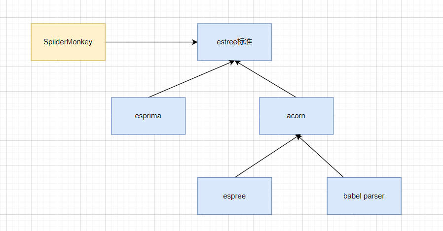

---
nav:
  title: Babel
  order: 7
group:
  title: 概况
  order: 1
title: JS Parser的历史
order: 5
---

# JS Parser的历史

前面我们学习了`babel`的`parser`和`AST`。`babel`的`parser`是基于`acorn`扩展而来的。但是`acorn`并非最早的js parser。那么js parser的历史是怎么样的呢？

## SpiderMonkey和estree的标准

在 nodejs 出现之后，前端可以用 nodejs 来做一些工程化的事情，也就有了对 js parser 的需求，当时 Mozilla 在 MDN 上公布了 SpiderMonkey（c++ 写的 js 引擎）的 parser api 和 AST 标准，所以当时最早的 JS parser ---- esprima 就是基于 SpiderMonkey 的 AST 标准来实现的，后来形成了 estree 标准。 当时很多的前端领域的工具都基于 esprima。

## acorn标准

后面出现了`acorn`,也就是estree标准的实现，支持插件，且效率高，所以很多工具都转用了`acorn`.

- eslint的parser -- espree本来是基于esprima,后面使用acorn重新实现。
- babel parser(babylon)也是基于acorn，并对AST节点和属性做了拓展，支持`typescript`,`jsx`、`flow`的语法解析。


## js parser之间的关系



他们的关系如图所示，`estree`标准是基于`Spider Monkey`的`AST`标准扩展的，他的实现有`esprima`、`acorn`等，现在`espree`、`babel parser`都是基于`acorn`做的扩展，因为`acorn`提供了插件机制。

当然也不是所有的 js parser 都是 estree 标准的，比如 terser、typescript 等都有自己的 AST 标准。

### babel parser 对 estree AST 的扩展

`babel` 基于 `acorn` 插件对 `estree` `AST` 做了如下扩展

- 把 `Literal` 替换成了 `StringLiteral`、`NumericLiteral`、 `BigIntLiteral`、 `BooleanLiteral`、 `NullLiteral`、 `RegExpLiteral`
- 把 Property 替换成了 ObjectProperty 和 ObjectMethod
把 MethodDefinition 替换成了 ClassMethod
- Program 和 BlockStatement 支持了 directives 属性，也就是 'use strict' 等指令的解析，对应的 ast 是 Directive 和 DirectiveLiteral
- ChainExpression 替换为了 ObjectMemberExpression 和 OptionalCallExpression
- ImportExpression 替换为了 CallExpression 并且 callee 属性设置为 Import

[babel parser](https://babeljs.io/docs/en/babel-parser#output)

## acorn插件

babel parser 基于 acorn 扩展了一些语法，那它是怎么扩展的呢？ 我们写一个 acorn 插件来感受一下。

acorn 主要是一个 Parser 类，不同的方法实现了不同的逻辑，插件扩展就是继承这个 Parser，重写一些方法。

acorn 的 api 如下，其中 acorn-jsx、acorn-bigint 就是 acorn 插件

接下来我们写一个 acorn 插件：

> 给 javascript 一个关键字 hug，可以作为 statement 单独使用

我们知道 parse 的过程其实就是`分词` + `组装 AST`这两步（一般叫词法分析和语法分析），我们只要实现这两步就可以了。

### 分词（词法分析）

我们只想增加一个关键字,`acorn`有`keyword`属性，是一个正则表达式，用于关键字拆分，我们重写`keyword`的属性就看了一，并且为新的关键字注册一个`token`类型。

`acorn Parser`的入口方法是`parse`,我们将`parse`方法中设置`keywords`;

### 组装AST（语法分析）

光分出 token 是没意义的，要组装到 AST 中。

acorn 在 parse 到不同类型的节点会调用不同的 parseXxx 方法，因为我们是在 statement 里面用，那么就要重写 parseStatement 方法，在里面组装新的 statement 节点。

完整代码如下：

```javascript
const acorn = require("acorn");

const Parser = acorn.Parser;
const TokenType = acorn.TokenType;

Parser.acorn.keywordTypes["guang"] = new TokenType("guang",{keyword: "guang"});

function wordsRegexp(words) {
  return new RegExp("^(?:" + words.replace(/ /g, "|") + ")$")
}

var guangKeyword = function(Parser) {
  return class extends Parser {
    parse(program) {
      let newKeywords = "break case catch continue debugger default do else finally for function if return switch throw try var while with null true false instanceof typeof void delete new in this const class extends export import super";
      newKeywords += " guang";
      this.keywords = new RegExp("^(?:" + newKeywords.replace(/ /g, "|") + ")$")
      return(super.parse(program));
    }

    parseStatement(context, topLevel, exports) {
      var starttype = this.type;

      if (starttype == Parser.acorn.keywordTypes["guang"]) {
        var node = this.startNode();
        return this.parseGuangStatement(node);
      }
      else {
        return(super.parseStatement(context, topLevel, exports));
      }
    }

    parseGuangStatement(node) {
      this.next();
      return this.finishNode({value: 'guang'},'GuangStatement');//新增加的ssh语句
    };
  }
}
const newParser = Parser.extend(guangKeyword);
```

我们执行下试下效果

```javascript
const newParser = Parser.extend(guangKeywordPlugin);

var program = 
`
    guang
    const a = 1
`;

const ast = newParser.parse(program);
console.log(ast);
```

产生的AST如下：

```
Node {
  type: 'Program',
  start: 0,
  end: 27,
  body: [
    { value: 'guang', type: 'GuangStatement', end: 10 },
    Node {
      type: 'VariableDeclaration',
      start: 15,
      end: 26,
      declarations: [Array],
      kind: 'const'
    }
  ],
  sourceType: 'script'
}
```

就这样我们实现了新的 AST 节点。

通过这个简单的例子，我们能大概理解 babel 是怎么基于 acorn 实现 typescript、jsx、flow 语法解析的了。

比如 Literal 扩展了 StringLiteral、NumericLiteral 等这一点，我们就可以自己实现：

```javascript
parseLiteral (...args) {
    const node = super.parseLiteral(...args);
    switch(typeof node.value) {
        case 'number':
            node.type = 'NumericLiteral';
            break;
        case 'string':
            node.type = 'StringLiteral';
            break;
    }
    return  node;
}
```

## 总结

学完这一节，我们更全面的了解了 js parser 的历史，对各种工具所用的 parser 之间的关系有了一定的了解，并且还知道了 acorn 的语法插件该怎么写。

## 参考

[Babel 插件通关秘籍 - zxg_神说要有光 - 掘金课程 (juejin.cn)](https://juejin.cn/book/6946117847848321055/section/6947682728200372232)