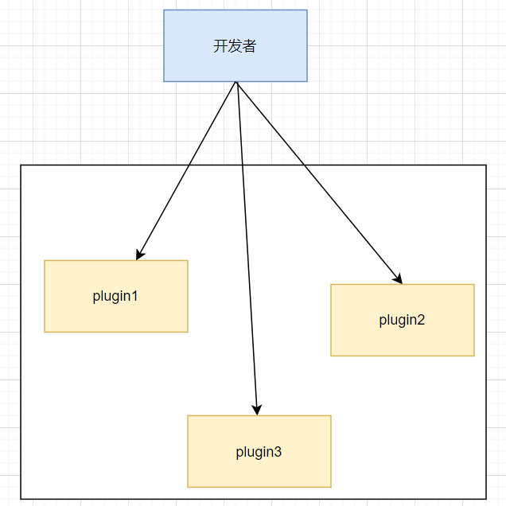
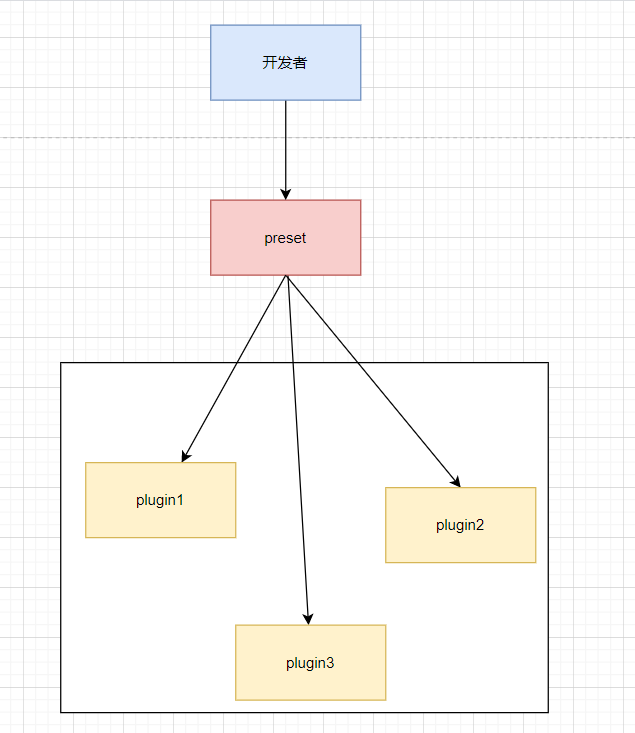

---
nav:
  title: Babel
  order: 7
group:
  title: 介绍
  order: 1
title: Babel插件和preset
order: 8
---

# Babel插件和preset

我们前面学习了`babel`的编译了流程,知道了`babel`提供了一些`api`来进行代码转换功能。但平时我们很少单独使用`babel`的`api`,更多是封装成插件。

## Plugin的使用

我们来看看插件的一个使用方法。

```json
{
  "plugins": ["pluginA", ["pluginB"]]
}
```

## Plugin的格式

babel plugin的格式有两种

### 返回对象的函数

第一种是一个函数返回一个对象的格式，对象中有`visitor`,`pre`,`post`,`inherits`,`manipulateOptions`等属性。

```ts
export default function (api, options, dirname) {
  return {
    inherits: parentPlugins,
    manipulateOptions(options, parserOptions) {
      options.xxx = '';
    },
    pre(file) {
      this.cache = new Map();
    },
    visitor: {
      xxxxLiteral(path, state) {
        //  code
      }
    },
    post(file) {
      console.log(this.cache);
    }
  }
}
```

首先，插件函数有 3 个参数，api、options、dirname。

- options是外部传入的参数
- dirname是目录名
- api中包含各种`babel`的api，如`type`、`template`

返回的对象有 inherits、manipulateOptions、pre、visitor、post 等属性。
- inherits 指定继承某个插件，和当前插件的 options 合并，通过 Object.assign 的方式。
- visitor 指定 traverse 时调用的函数。
- pre 和 post 分别在遍历前后调用，可以做一些插件调用前后的逻辑，比如可以往 file（表示文件的对象，在插件里面通过 state.file 拿到）中放一些东西，在遍历的过程中取出来。
- manipulateOptions 用于修改 options，是在插件里面修改配置的方式，比如 syntaxt plugin一般都会修改 parser options：

插件做的事情就是通过`api`拿到`types`、`template`等，再通过`state.opts`拿到参数，然后通过`path`来修改`AST`。

### 对象

插件的第二种格式就是直接写一个对象，不用函数包裹，这种方式用于不需要处理参数的情况。

```ts
export default plugin =  {
    pre(state) {
      this.cache = new Map();
    },
    visitor: {
      StringLiteral(path, state) {
        this.cache.set(path.node.value, 1);
      }
    },
    post(state) {
      console.log(this.cache);
    }
};
```

## preset

plugin 是单个转换功能的实现，当 plugin 比较多或者 plugin 的 options 比较多的时候就会导致使用成本升高。这时候可以封装成一个 preset，用户可以通过 preset 来批量引入 plugin 并进行一些配置。preset 就是对 babel 配置的一层封装。

比如如果使用 plugin 是这样的，开发者需要了解每个插件是干什么的。



而有了 preset 之后就不再需要知道用到了什么插件，只需要选择合适的 preset，然后配置一下，就会引入需要的插件，这就是 preset 的意义。我们学 babel 的内置功能，主要就是学 preset 的配置，比如 preset-env、preset-typescript 等。



preset 格式和 plugin 一样，也是可以是一个对象，或者是一个函数，函数的参数也是一样的 api 和 options，区别只是 preset 返回的是配置对象，包含 plugins、presets 等配置。

```javascript
export default function(api, options) {
  return {
      plugins: ['pluginA'],
      presets: [['presetsB', { options: 'bbb'}]]
  }
}
```

或者

```javascript
export default obj = {
      plugins: ['pluginA'],
      presets: [['presetsB', { options: 'bbb'}]]
}
```

## 顺序

preset 和 plugin 从形式上差不多，但是应用顺序不同。

babel 会按照如下顺序处理插件和 preset：

1. 先应用 plugin，再应用 preset
2. plugin 从前到后，preset 从后到前

这个顺序是 babel 的规定。

## 总结

这一节我们学习了 babel 的 plugin 和 preset 的格式，两者基本一样，都是可以对象和函数两种形式，函数的形式接收 api 和 options 参数，babel7 的插件最好使用兼容写法，就是用 declare 包裹一层。还可以通过 @babel/core 包里的 createConfigItem 来创建配置项，方便抽离出去。 plugin 和 preset 是有顺序的，先 plugin 再 preset，plugin 从左到右，preset 从右到左。

这一节主要学习插件的的格式和规则，具体转换逻辑还是之前的方式，结合之前学的 babel api，就可以开发插件了。

## 参考

- [Babel 插件通关秘籍](https://juejin.cn/book/6946117847848321055)