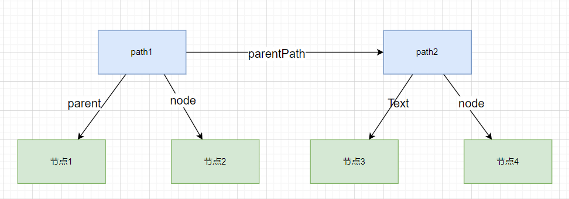

---
nav:
  title: Babel
  order: 7
group:
  title: 介绍
  order: 1
title: Traverse
order: 6
---

源码通过`parse`生成了`AST`之后，需要对`AST`进行遍历和修改。那么`transform`的流程是怎么样的呢。

`babel`会遍历`AST`，遍历过程中处理到不同的`AST`节点会调用不同的`visitor`来实现`transform`。这是访问者模式的应用。

## 路径和作用域
`babel`的`AST`本身更多的就是描述数据的一个抽象，包含源码的一些信息，如果我们要操作`AST`时候需要拿到其他节点信息，或者是你做增删改的方法，这些其实都是要用到`path`。



### path 的属性

由于`@babel/traverse`中并没有详细的问题进行记录，所以在这里可以参考以下的链接。
- [Path](https://github.com/jamiebuilds/babel-handbook/blob/master/translations/zh-Hans/plugin-handbook.md#paths%E8%B7%AF%E5%BE%84)
- [Babel-traverse-api-doc](https://evilrecluse.top/Babel-traverse-api-doc/#/?id=nodepath-%e5%b1%9e%e6%80%a7)


大致与以下的方法

```javascript
path {
    // 属性：
    node 
    parent
    parentPath
    scope
    hub
    container
    key
    listKey
    
    // 方法
    get(key) 
    set(key, node)
    inList()
    getSibling(key) 
    getNextSibling()
    getPrevSibling()
    getAllPrevSiblings()
    getAllNextSiblings()
    isXxx(opts)
    assertXxx(opts)
    find(callback)
    findParent(callback)
    
    insertBefore(nodes)
    insertAfter(nodes)
    replaceWith(replacement)
    replaceWithMultiple(nodes)
    replaceWithSourceString(replacement)
    remove()
    
    traverse(visitor, state)
    skip()
    stop()
}
```

它们各自的含义：

- path.node 当前 AST 节点
- path.parent 父 AST 节点
- path.parentPath 父 AST 节点的 path
- path.scope 作用域，见下文详解
- path.hub 可以通过 path.hub.file 拿到最外层 File 对象， path.hub.getScope 拿到最外层作用域，path.hub.getCode 拿到源码字符串
- path.container 当前 AST 节点所在的父节点属性的属性值
- path.key 当前 AST 节点所在父节点属性的属性名或所在数组的下标
- path.listkey 当前 AST 节点所在父节点属性的属性值为数组时 listkey 为该属性名，否则为 undefined

### path 的方法

path 有如下方法

- inList() 判断节点是否在数组中，如果 container 为数组，也就是有 listkey 的时候，返回 true
- get(key) 获取某个属性的 path
- set(key, node) 设置某个属性的值
- getSibling(key) 获取某个下标的兄弟节点
- getNextSibling() 获取下一个兄弟节点
- getPrevSibling() 获取上一个兄弟节点
- getAllPrevSiblings() 获取之前的所有兄弟节点
- getAllNextSiblings() 获取之后的所有兄弟节点
- find(callback) 从当前节点到根节点来查找节点（包括当前节点），调用 callback（传入 path）来决定是否终止查找
- findParent(callback) 从当前节点到根节点来查找节点（不包括当前节点），调用 callback（传入 path）来决定是否终止查找
- isXxx(opts) 判断当前节点是否是某个类型，可以传入属性和属性值进一步判断，比如path.isIdentifier({name: 'a'})
- assertXxx(opts) 同 isXxx，但是不返回布尔值，而是抛出异常
- insertBefore(nodes) 在之前插入节点，可以是单个节点或者节点数组
- insertAfter(nodes) 在之后插入节点，可以是单个节点或者节点数组
- replaceWith(replacement) 用某个节点替换当前节点
- replaceWithMultiple(nodes) 用多个节点替换当前节点
- replaceWithSourceString(replacement) 解析源码成 AST，然后替换当前节点
- remove() 删除当前节点
- traverse(visitor, state) 遍历当前节点的子节点，传入 visitor 和 state（state 是不同节点间传递数据的方式）
- skip() 跳过当前节点的子节点的遍历
- stop() 结束所有遍历

### 作用域 path.scope

scope 是作用域信息，javascript 中能生成作用域的就是模块、函数、块等，而且作用域之间会形成嵌套关系，也就是作用域链。babel 在遍历的过程中会生成作用域链保存在 path.scope 中。

属性和方法大概有这些

```
path.scope {
    bindings
    block
    parent
    parentBlock
    path
    references
 
    dump()
    parentBlock()
    getAllBindings()
    getBinding(name)
    hasBinding(name)
    getOwnBinding(name)
    parentHasBinding(name)
    removeBinding(name)
    moveBindingTo(name, scope)
    generateUid(name)
}
```

各自的含义：

- scope.bindings 当前作用域内声明的所有变量
- scope.block 生成作用域的 block，详见下文
- scope.path 生成作用域的节点对应的 path
- scope.references 所有 binding 的引用对应的 path，详见下文
- scope.dump() 打印作用域链的所有 binding 到控制台
- scope.parentBlock() 父级作用域的 block
- getAllBindings() 从当前作用域到根作用域的所有 binding 的合并
- getBinding(name) 查找某个 binding，从当前作用域一直查找到根作用域
- getOwnBinding(name) 从当前作用域查找 binding
- parentHasBinding(name, noGlobals) 查找某个 binding，从父作用域查到根作用域，不包括当前作用域。可以通过 noGlobals 参数指定是否算上全局变量（比如console，不需要声明就可用），默认是 false
- removeBinding(name) 删除某个 binding
- hasBinding(name, noGlobals) 从当前作用域查找 binding，可以指定是否算上全局变量，默认是 false
- moveBindingTo(name, scope) 把当前作用域中的某个 binding 移动到其他作用域
- generateUid(name) 生成作用域内唯一的名字，根据 name 添加下划线，比如 name 为 a，会尝试生成 _a，如果被占用就会生成 __a，直到生成没有被使用的名字。

#### scope.block

能形成 scope 的有这些节点，这些节点也叫 block 节点。

```javascript
export type Scopable =
  | BlockStatement
  | CatchClause
  | DoWhileStatement
  | ForInStatement
  | ForStatement
  | FunctionDeclaration
  | FunctionExpression
  | Program
  | ObjectMethod
  | SwitchStatement
  | WhileStatement
  | ArrowFunctionExpression
  | ClassExpression
  | ClassDeclaration
  | ForOfStatement
  | ClassMethod
  | ClassPrivateMethod
  | StaticBlock
  | TSModuleBlock;
```

我们可以通过 path.scope.block 来拿到所在的块对应的节点，通过 path.scope.parentBlock 拿到父作用域对应的块节点。

一般情况下我们不需要拿到生成作用域的块节点，只需要通过 path.scope 拿到作用域的信息，通过 path.scope.parent 拿到父作用域的信息。

### scope.bindings, scope.references

作用域中保存的是声明的变量和对应的值，每个声明为一个`binding`（绑定）。

```js
const a = 1;
```

实际的`path.scope.bindings`是这样的

```json
bindings: {
  a: {
    constant: true,
    constantViolations: [],
    identifier: {type: 'Identifier', ...}
    kind:'const',
    path: {node,...}
    referenced: false
    referencePaths: [],
    references: 0,
    scope: ...
  }
}
```

因为我们在当前 scope 中声明了 a 这个变量，所以 bindings 中有 a 的 binding，每一个 binding 都有 kind，这代表绑定的类型：

- var、let、const 分别代表 var、let、const 形式声明的变量
- param 代表参数的声明
- module 代表 import 的变量的声明

binding 有多种 kind，代表不同的声明方式。

binding.identifier 和 binding.path，分别代表标识符的 AST、整个声明语句的 AST。

声明之后的变量会被引用和修改，binding.referenced 代表声明的变量是否被引用，binding.constant 代表变量是否被修改过。如果被引用了，就可以通过 binding.referencePaths 拿到所有引用的语句的 path。如果被修改了，可以通过 binding.constViolations 拿到所有修改的语句的 path。

path 的 api 还是比较多的，这也是 babel 最强大的地方。主要是操作当前节点、当前节点的父节点、兄弟节点，作用域，以及增删改的方法。

## state

state 是遍历过程中 AST 节点之间传递数据的方式，插件的 visitor 中，第一个参数是 path，第二个参数就是 state。插件可以从 state 中拿到 opts，也就是插件的配置项，也可以拿到 file 对象，file 中有一些文件级别的信息，这个也可以从 path.hub.file 中拿。

```
state {
    file
    opts
}
```

可以在遍历的过程中在 state 中存一些状态信息，用于后续的 AST 处理。不是遍历过程中的数据，可以通过 file.set、file.get 来保存。

## AST 的别名

遍历的时候要指定 visitor 处理的 AST，有的时候需要对多个节点做同样的处理，babel 支持指定多个 AST 类型，也可以通过别名指定一系列类型。

```javascript
  // 单个 AST 类型
  FunctionDeclaration(path, state) {},
  // 多个 AST 类型
  'FunctionDeclaration|VariableDeclaration'(path, state) {}
  // AST 类型别名
  Declaration(){}
```

## 总结

- path的api和属性
- scope的概念
- AST的别名。

## 参考

- [Babel 插件通关秘籍](https://juejin.cn/book/6946117847848321055)