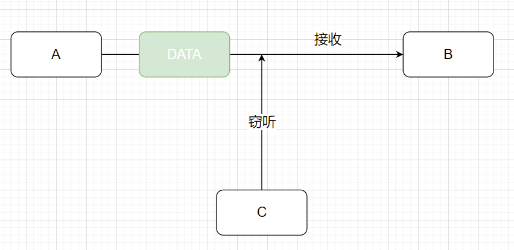
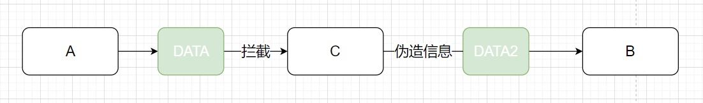
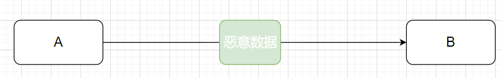

---
nav:
  title: 计算机网络
  order: 4
group:
  title: HTTP
  order: 4
title: HTTPS
order: 8
---
# HTTPS

**超文本传输安全协议**（Hyper Text Transfer Protocol over Secure Socket Layer，HTTPS），是一种通过计算机网络进行安全通信的传输协议。

HTTPS经由HTTP进行通信，但利用SSL/TLS来加密数据包。HTTPS的主要目的，是提供对网站服务器的身份认证，保护交换数据的隐私和完整性。

```text
HTTPs = HTTP + SSL (加密+认证+完整性保护)
```

HTTP 协议采用明文传输信息，存在信息窃听、信息篡改和信息劫持的风险，而协议 SSL / TLS 具有**身份验证**、**信息加密**、**完整性检验**的功能，可以避免此类问题发生。

SSL / TLS 全称安全传输层协议 Transport Layer Security，是介于 TCP 和 HTTP 之间的一层安全协议，不影响原有的 TCP 协议和 HTTP 协议，所以使用 HTTPS 基本上不需要对 HTTP 页面进行太多的改造。

## HTTP存在的安全问题

使用HTTP协议存在以下的问题

- **窃听**：HTTP明文传输，只要这个请求被拦截，便可以窃听其中的内容。
- **伪造**：第三方拦截内容，并伪造成发送方向接收方发送数据。
- **否认**：发送方将**恶意数据**发送给接受方并否认这些数据是它发送的

窃听属于**信息加密**问题，伪造和否认属于**身份验证**问题。

### 窃听



### 伪造



### 否认



## 解决方案

- **对称加密**：使用相同密钥加密/解密，但是钥匙交付问题无法解决
- **非对称性加密**：双方都给对方自己的公钥，自己保存着自己的私钥，之后一方给另一方发送数据时，用对方的公钥进行加密，而收到数据时，用自己的私钥进行解密。加密/解密消耗时间较多。
- **混合加密**： 非对称性加密先用对方的公钥加密自己产生的对称性加密公钥作为会话密钥发送给另外一方，另外一方拿到后，就可以用自己的私钥进行解密，得到会话密钥，之后靠这个加解密。解决非对称加密效率问题
- **中间人攻击**：秘密替换公钥窃取数据，源于服务端无法确认客户端公钥是否合法
- **消息鉴别码**：`MAC` 密钥和密文组成的字符串的哈希值。能够解决 `伪造` 问题，但无法解决 `否认` 问题
- **数字签名**：服务端创建数字签名，而客户端只验证签名是否正确。解决 `否认` 问题

- **数字证书**：由权威机构背书创建证书，保证公钥不被篡改。解决 `中间人攻击` 问题

### 对称加密

**对称加密算**法（Symmetric Key Algorithms）加密使用的密钥和解密使用的密钥是相同的。也就是说，加密和解密都是使用的同一个密钥。因此对称加密算法要保证安全性的话，密钥要做好保密，只能让使用的人知道，不能对外公开。


**对称密钥加密**一个很重要的特点就是使用相同的密钥进行加密和解密


假设 B 是没有解密钥匙，所以 A 需要通过互联网将钥匙发送给 B。

但是 X 也有可能看到并获取到这个钥匙，因此，X 也可以通过这个钥匙来解密密文。

上面这个场景就会引出一个新问题，这个问题被称为**钥匙交付问题**，那怎么解决这个问题？

### 非对称性加密

接收方 B 创建一个公钥和一个私钥，公钥被发送给 A。


- A 使用从 B 收到的公钥加密数据，将密文发送给 B
- B 使用私钥解密从 A 接收到的密文，得到原始数据


在这个过程中：

- 密文和公钥也可能被恶意第三方 X 截获
- 但是私钥是 B 保存的，X 无法获取到，自然没有办法解密密文
- 这样就很好的解决了**钥匙交付问题**

**公开密钥加密的问题**

1. 加密和解密都需要耗费时间，有一种叫**混合加密**的方法可以解决这个问题
2. 公开密钥的可靠性

### 混合加密


混合密钥加密分为两个步骤：

- 通过公开密钥加密传递密钥
- 通过速度更快的对称密钥加密方法传递数据

这只能解决窃听问题，但无法解决否认和伪造问题。

### 中间人攻击

中间人攻击（Man In the Middle Attack）。

为了更好地理解公开密钥加密的可靠性问题，我们回到传递公钥的场景。


在此过程中，中间人拦截了公钥Pb，同时自己生成了自己的公钥Px和私钥Sx，同时将Px发改A

此时A收到了伪造公钥，但是并不知道这是伪造公钥。


最后，X 用他自己的密钥加密响应数据，并发送给 A，就这样，虽然 A、B 双方能顺利完成通信，但是恶意的第三方 X 能看到解密后的请求数据和响应数据，甚至可以对其进行篡改，而 A、B 双方则毫不知情。

中间人攻击的攻击方式：

- 域名污染：DNS 解析的中间链点返回中间人错误 IP
- ARP 欺骗

潜在的中间人攻击威胁：

- 浏览器弹出的证书警告，可能访问的是钓鱼网站或假冒的服务器
- 公共 Wifi 下，没有 HTTPS 加密的网站不要随便登录
- 在任何网站登录账号必须走 HTTPS 加密协议

### 消息鉴别码

消息鉴别码（Message Authentication Code，简写 MAC）是一种用于确认消息完整性（数据不会被篡改）和可靠性（消息认证是确认消息来自正确的发送者）的技术。消息鉴别码可以理解为**密钥**和**密文**组成的字符串的**哈希值**。


消息鉴别码虽然可以解决**伪造**问题，但是仍然无法避免**否认**问题。

### 数字签名

为了解决这个**否认**问题，我们接下来看看**数字签名**方法。

数据发送方通过约定的哈希函数从数据报文中生成报文摘要，然后利用私钥对报文摘要进行加密，这个加密后的摘要将作为报文的**数字签名**和**数据报文**一起发送到接收方。

数据接收方首先使用与发送方一致的哈希函数从接收到的数据报文中计算报文摘要，同时，利用发送方的公钥对数据签名进行解密，得出摘要，如果摘要相同，则接收方就能确定该数字签名是发送方的。


### 数字证书

虽然上面的方法已经能避免窃听、伪造、否认等问题，但是现在还是没办法避免**中间人攻击**，因为我们还是没办法验证公钥的所有者，因此我们需要**数字证书**系统来验证公钥的所有者。

接下来，先看看数字证书申请的过程，我们将数字证书认证机构（Certificate Authority）称之为 CA。

**数字证书申请过程：**

1. 服务器方向第三方机构 CA **提交公钥**、**组织信息**、**个人信息（域名）** 等信息并申请认证
2. CA 通过线上、线下等多种手段验证申请者提供信息的真实性，如组织是否存在、企业是否合法、是否拥有域名的所有权等
3. 如信息审核通过，CA 会向申请者签发认证文件证书。证书包含以下信息：**申请者公钥**、**申请者的组织**和**个人信息**、**签发机构 CA 的信息**、**有效时间**、**证书序列号**等信息的明文，同时包含**数字签名**。数字签名通过**散列函数**计算公开的明文信息的**信息摘要**，然后，采用 CA 提供的私钥对信息摘要进行加密，加密后的信息摘要即为**数字签名**


**数字证书校验流程：**

1. 客户端向服务端发送请求，服务端返回数字证书文件。
2. 客户端读取证书中的相关的明文信息，采用与加密时相同的**散列函数**计算得到信息摘要，然后利用内置客户端中的受信任的CA公钥解密数字签名，对比证书的信息摘要
   - 如果一致，则可以确认证书的合法性，即公钥合法
   - 如果不一致，则可以确认证书为非法，即公钥非法
   - 如果 CA 不被信任，则找不到对应 CA 证书，证书也会被判定为非法，即公钥非法
3. 客户端验证证书相关的域名信息、有效时间等信息


现在可以验证 PB 是属于 B 的，但是怎么验证 PC 是属于受信任的 CA 的呢。


事实上，认证机构形成一个树形结构，高级别的权威机构为较低级别的机构创建证书，那就是说，如果要验证的话，就是一级一级向上认证，信任链条的最终是 Root CA，他采用自签名，对他的签名是无条件的信任。


### 工作流程

HTTPS 在传输数据之前需要客户端（浏览器）与服务端之间进行一次握手，在握手过程中将确立双方加密传输数据的密码信息。TLS/SSL 协议使用**非对称加密**、**对称加密**以及 **HASH 算法**确保信息通信的安全。


**具体流程**：

1. **Client Hello**：客户端发起HTTPS请求。
   - 不同的客户端对不同的加密算法的支持度不同，因此客户端会将支持的一套**加密套件**（Cipher Suite）发送给服务端（除了加密组合方式，报文中还包括 TLS 的协议版本、随机生成的密码串记为 Random1、会话 ID、域名 ServerName 以及签名算法）
2. **Serve hello**：服务端从客户端支持的加密规则中选用一组加密算法（包括用于生成通信密钥的算法，用于。。的，和用于 HASH 算法），并随机生成密码串记为 Random2，后续将数据传回客户端。
   - **Certificate**: 服务端收到Client Hello之后，向客户端发送CA认证的数字证书，用来鉴别服务端身份信息，同时还要生成一个随机数同时保存在服务端和发送给客户端。证书包含**网站信息**、**CA私钥加密的通信公钥**，以及**经证书的颁发机构私钥加密产生的数字签名**等信息。
   - **Server Hello Done**：表示服务端宣告第一阶段的客户端服务端握手协商结束
   - 可选：**Certificate Request**：必要情况下，要求客户端发送证书验证身份
   - 可选：**Server Key Exchange**：如果 CA 认证的数字证书提供的信息不够，服务端还可发送提供补充信息
3. **Client Finish**
   - **Client Key Exchange**
     - 客户端收到 CA 数字证书并通过验证，然后通过 CA 公钥解密获取到 **服务端公钥**
     - 客户端先读取数字证书中相关的明文信息，采用相同的 Hash 函数计算得到**信息摘要**，然后利用内置在客户端中的对应的 CA 的公钥解密**数字签名**数据，并与数字证书的摘要进行对比
       - 如果一致，则证书合法，即公钥合法（如果证书受信任，则客户端地址栏会显示小锁头）
       - 如果不一致，则证书非法，即公钥非法（如果证书不受信任，则会提示用户证书存在问题）
     - 如果证书受信任，客户端会根据两个 pubkey 随机数生成一串随机数的密钥记为 Pre-Master 随机数，并利用两次 Hello 报文产生的两个随机数 Random1 和 Random2，利用对称密钥生成算法生成对称密钥 `enc_key = Func(Random1, Random2, Pre-Master)`（即**消息鉴别码**：即用于终端数据交互的**对称密钥**），并用证书中提供的服务端公钥加密该随机数
     - **传送加密信息**：使用约定好的 HASH 算法计算握手信息，并使用**对称密钥**对消息进行加密，最后将之前生成的所有信息发送给服务端
   - **Change Cipher Spec**：该报文通知服务端，此后的通信都将使用协商好的加密算法计算对称密钥进行加密通信（也就是使用两个随机数以及第三个 Pre-master key/secret 随机数一起算出一个对称密钥 **session key/secret**）
   - **Finished**报文：该报文包括连接至此的所有报文的校验值，使用服务端公钥进行加密
   - 可选：**ClientCertificate** 报文：如果服务端请求，客户端需要发送 CA 数字证书
   - 可选：**CertificateVerify** 报文：服务端如果要求 CA 数字证书，那么需要通过 HASH 算法计算一个服务端发送来的信息摘要
4. **Serve Finish**:使用私钥将信息解密取出密钥，使用密钥解密客户端发来的握手信息，并验证 HASH 是否与浏览器发来的一致
   - **New Session Ticket**：服务端最后对客户端发送过来的 Finished 报文使用服务端私钥进行解密校验
   - **Change Cipher Spec**：报文通知服务端，此后的通信都将使用协商好的加密算法计算对称密钥 session key/secret 进行加密通信
   - **Finished** 报文：标志 TLS 连接建立成功
5. 浏览器解密并计算握手信息的 Hash，如果与服务端发来的 Hash 一致，此时握手过程结束，之后所有的通信数据将由之前客户端生成的对称密钥并利用堆成加密算法进行加密

## 相关算法

### 散列函数

常见的散列函数 Hash 算法：[MD5](https://zh.wikipedia.org/wiki/MD5)、[SHA1](https://zh.wikipedia.org/wiki/SHA-1)、[SHA256](https://zh.wikipedia.org/wiki/SHA家族)

散列函数特点是函数单向不可逆转、对输入非常敏感、输出长度固定，针对数据的任何修改都会改变散列函数的结果，用于**防止信息篡改**并**验证数据的完整性**。

在信息传递过程中，散列函数不能单独实现信息信息防篡改，因为**明文传输**，中间人可以修改信息之后重新计算信息摘要，因此需要对传输的信息以及信息摘要进行加密。

### 对称加密

常见的对称加密算法：[AES-CBC](https://zh.wikipedia.org/wiki/AES指令集)、[DES](https://zh.wikipedia.org/wiki/資料加密標準)、[3DES](https://zh.wikipedia.org/wiki/3DES)、[RC4](https://zh.wikipedia.org/wiki/RC4)

相同的密钥可以用于信息的加密和解密，掌握密钥才能获取信息，能够防止信息窃听，通信方式是 1 对 1。

对称加密的优势是信息传输 1 对 1，需要共享相同的密码，密码的安全是保证信息安全的基础，服务器和 N 个客户端通信，需要维持 N 个密码记录，且缺少修改密码的机制。

### 非对称加密

常见非对称加密算法：[RSA](https://zh.wikipedia.org/wiki/RSA加密演算法)、DSA / DSS

密钥成对出现，一般称为公钥（公开）和私钥（保密），公钥加密的信息只能私钥解开，私钥加密的信息只能公钥解开。因此掌握公钥的不同客户端之间不能互相解密信息，只能和掌握私钥的服务器进行加密通信，服务器可以实现 1 对 N 的通信，客户端也可以用来验证掌握私钥的服务器身份。

非对称加密的特点是 1 对多，服务器只需要维持一个私钥就能够和多个客户端进行加密通信，但服务器发出的信息能够被所有的客户端解密，且该算法的计算复杂，加密速度慢。

## 通信协议对比

**HTTP 协议和 HTTPS 协议的区别**

| 区别     | HTTP                                                         | HTTPS                                                        |
| -------- | ------------------------------------------------------------ | ------------------------------------------------------------ |
| 协议     | 运行在TCP之上。明文传输，客户端与服务端都无法验证通信双发的身份 | 基于SSL的HTTP，运行在SSL之上，SSL运行在TCP之上，是添加了加密和认证机制的HTTP |
| 端口     | 80                                                           | 443                                                          |
| 资源消耗 | 较少                                                         | 由于加密处理，会有更多的消耗                                 |
| 开销     | 无需证书                                                     | 需要CA证书，而证书一般需要向认证机构购买                     |
| 加密机制 | 无，明文传输                                                 | 共享密钥加密和公开密钥加密并用的混合加密机制                 |
| 安全性   | 弱                                                           | 强                                                           |

**HTTPS 主要作用**

- 对数据进行加密，并建立一个信息安全通道，来保证传输过程中的数据安全
- 对网站服务器进行真实身份认证

---

**参考资料：**

- [https](https://tsejx.github.io/javascript-guidebook/computer-networks/http/https)
- [深入理解HTTPS工作原理](https://juejin.cn/post/6844903830916694030)
- [谈谈 HTTPS](https://juejin.cn/post/6844903504046211079#heading-10)
- [前端基础篇之HTTP协议](https://juejin.cn/post/6844903844216832007)