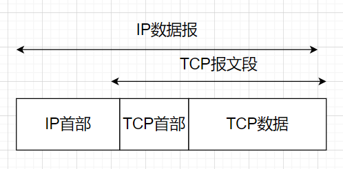
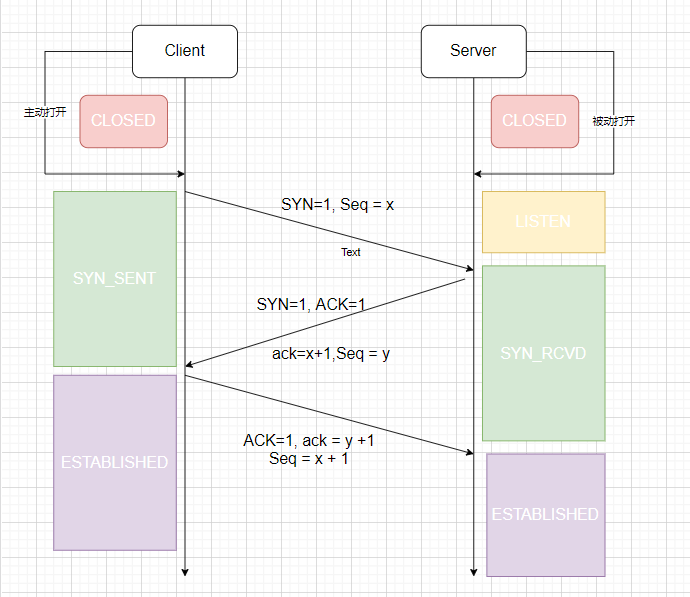
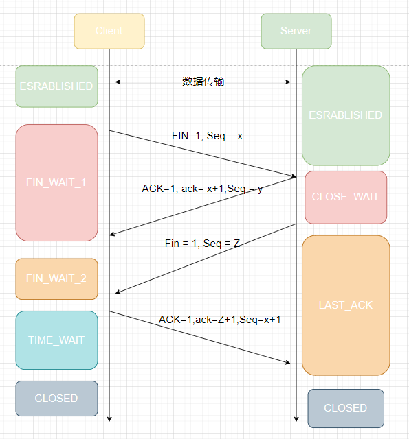
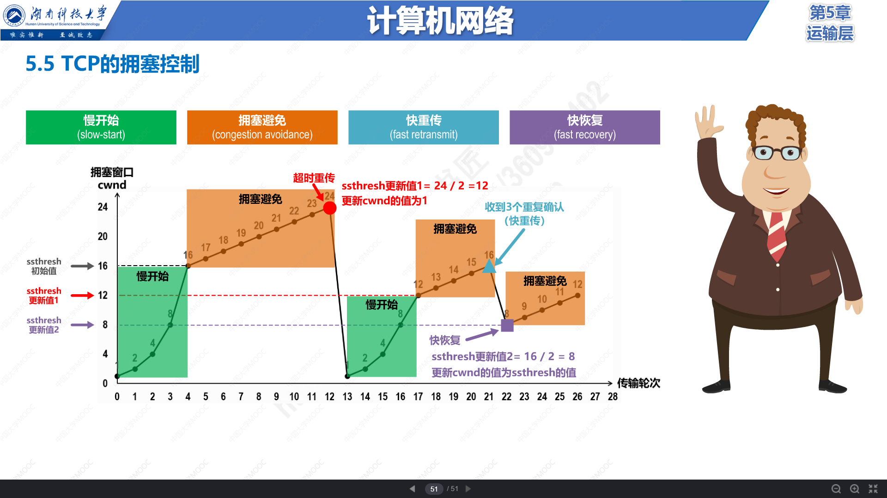

---
nav:
  title: 计算机网络
  order: 4
group:
  title: 运输层协议
  order: 3
title: TCP
order: 2
---
# TCP 传输控制协议

**传输控制协议**(Transmission Control Protocol,简称 TCP)是一种**面向连接**的、可靠的、基于IP协议的运输层服务。

- 每一条TCP连接上只有两个端点，每一条TCP连接只能是一对一。
- TCP提供可靠交付的服务，通过TCP连接传送的数据，无差错，不丢失、不重复、按序到达。
- TCP提供全双工通信，TCP允许通信的双方的应用进程在任何时候都能发送数据。TCP 连接的两端都设有发送缓存和接收缓存，用来临时存放双方通信的数据。
- 面向字节流，TCP中的流指得是流入进程或从进程流出的字节序列。

## TCP协议特点

- 点对点（不能广播、多播），面向连接
- 双向传递（全双工）
- 字节流：打包成报文段、保证有序接收、重复报文自动丢弃
  - 缺点：不维护应用报文的边界（对比 HTTP、GEPC）
  - 优点：不强制要求应用必须离散的创建数据块，不限制数据块大小
- 流量控制：解决速度不匹配的问题
- 可靠传输服务（保证可达，丢包时通过重发进而增加时延实现可靠性）
- 拥塞控制

## TCP的可靠性如何保证

- 分块传送：数据被分割成**最合适**的数据块（UDP不进行分割）
- 等待确认：通过定时器等待接收端发送确认请求，收不到则重发
- 确认回复：收到请求后会发送确认回复
- 数据检验：保证首部和数据的检验和，检测数据有无变化
- 乱序排序：接收端能重新排序数据，以正确的顺序交付给应用层
- 重复丢弃：接收端可以丢弃重复的数据包
- 数据缓冲：两端有固定大小的缓冲区（滑动窗口），防止速度不匹配问题

## 数据包结构

### 宏观位置

- 没经过一层的报文都会增加相应的头部。
- TCP数据被封装在IP数据报中

### 首部格式

- **TCP首部通常包含20个字节（不包括任选字段）**
  - 1-2个字节，源端口号
  - 3-4个字节，目的端口号
  - 5-8：序号，每个数据报文都有自己的序号。**为了防止网络包乱序**。
  - 9-12：确认号，确认号是用来标识所响应的序号的数据包，是对于需要响应的数据包的序号+1，当然，这个数值，只有ACK字段为1的时候，他才有效。目的：**防止丢包**。
  - 第13位字节：首部长度。因为任选字段长度可变
  - 后6为bite：保留
  - 随后6bite：标识位。**控制各种状态**
  - 第15-16两个字节：窗口大小。接收端期望接收的字节数。**解决流量控制的问题**
  - 第17-18两个字节：校验和。由发送端计算和存储，由接收端校验。**解决数据正确性问题**
  - 第19-20两个字节：紧急指针
- **标识位的说明**
  - URG：为1，表示紧急指针有效。
  - ACK，确认表示，为1是，表示确认号有效。
  - PSH：接收方尽快把报文交给应用层。
  - RST：复位标识，重建连接
  - SYN：建立连接时，为1
  - FIN：关闭连接标识符
- 其他
  - 序列号(Seq = sequance number)
  - 确认号(Ack = acknowledgment number)

## 三次握手

### 为什么需要握手？

TCP提供面向连接的通信传输。面向有连接是指在数据传输之前两端都应该做好准备工作，也就是说无论哪一方发送数据，都得提前建立好连接。

三次握手指的时建立一个TCP连接需要客户端和服务端总共发送三个包以确认连接的建立。

### 握手的目的

- **同步双方的序列号和确认号**
  - 初始化序列号ISN
- **交换TCP窗口大小信息**
  - 如MSS、窗口比例因子，选择性确认，指定给检验和算法

### 握手的过程

三次握手过程分析：

1. **第一次握手：建立连接**，客户端发送连接请求报文段，将SYN置为1，同时产生自己的一个序列号Seq为x，（由操作系统动态随机选取一个 32 位长的序列号），并发送给服务端，客户端进入`SYN_SENT`状态。
2. **第二次握手**：**服务端收到SYN报文段并响应，确立连接请求**。服务端收到数据包后需要对标志位 SYN 报文段进行确认，设置ACK=1，设置确认号Ack=x+1，同时自己也要发送建立连接的请求，将SYN=1，同时自己也生成序列号Seq为y。服务器将上述的信息放在报文段中（SYN+ACK）的报文段，一并发送给客户端**确认建立连接**。进入`SYN_RCVD`状态
3. **第三次握手**：客户端收到SYN+ACK的报文段。确认后，然后将 Acknowledgment Number 设置为 Y+1，向服务端发送 ACK 报文段，这个报文段发送完毕后，客户端和服务器端进入 ESTABLISHED 状态，完成三次握手，随后客户端与服务器端之间可以开始传输数据了。

握手过程不包含数据。只有三次握手完毕后，客户端与服务器才正式开始传送数据。理想状态下，TCP 连接一旦建立，在通信双方中的任何一方主动关闭连接之前，TCP 连接都将被一直保持下去。

### 为什么要三次握手

主要是防止服务端开启无用的连接。

因为我们知道网络传输是有延时的，因为终端间隔了非常远的距离，数据包通过光纤以及各种中间代理服务器进行传输，但是在服务端和客户端的传输过程中，往往由于网络传输的不稳定原因丢失了数据包，客户端一直没有收到服务端返回的数据包，客户端可能设置了超时时间关闭了连接创建，那么就会再发起新的请求。如果没有第三次握手，服务端是不知道客户端到底有没有接收到服务端返回给他的数据的，客户端也没有一个确认说要关闭还是要创建这个请求，服务端的端口就一直开着，等着客户端发送实际的请求数据，那么这个时候开销就浪费了，服务端不知道这个连接已经创建失败了，可能客户端已经创建别的连接去了。

所以我们需要三次握手来确认这个过程，让服务端和客户端能及时察觉到网络原因导致的网络连接的关闭的问题，从而规避网络传输中因为延时导致导致的服务器开销问题。

### 三次握手第一次能携带数据吗？

不可以，因为还没建立连接。

### **第三次握手可以发送数据吗？为何？**

可以，此时的连接已经建立完毕，可以发送数据。

## 四次挥手

四次挥手即终止 TCP 连接，就是指断开一个 TCP 连接时，需要客户端和服务端总共发送 4 个包以确认连接的断开。在 Socket 编程中，这一过程由客户端或服务端任一方执行 `close` 来触发。

由于TCP是全双工的，所以对于一个连接上，每个方向我们都得单独关闭。

半关闭如何体现在如果一方发送连接断开报文，来终止这一方的连接，这只意为这个方向上不会再有数据的发送，而并不意为这自己不能再接受，另一方还是可以发送数据。等待另一方也没有数据发送，另一方会发送断开连接报文，关闭另外一个方向上数据的传输。

过程分析：

1. **第一次挥手**：客户端发送断开连接报文段，此时的报文段上FIN置为1，Seq为X，用于关闭客户端到服务器这个的数据传输，进入`FIN_WAIT_1`状态。
2. **第二次挥手**：服务器接收到FIN报文段，回复ACK报文段作为响应，ack置为X+1，告诉客户端，同意关闭请求，这时候客户端进入`FIN_WAIT_2`，服务器进入`CLOSE_WAIT`。注意：此时服务器还是能够向客户端数据发送请求的。
3. **第三次挥手**：当服务器数据传输完毕。则向客户端发送`FIN`报文段，seq为Z，意为关闭服务器到客户端的连接，服务端进入`LAST_ACK`状态
4. **第四次挥手**：客户端接收到请求后，就知道可以关闭连接了，但这个时候我们需要对服务器的请求包进行应答，所以发送了ACK=1，seq=X+1，ack=Z+1的报文段。进入`TIME_WAIT`的状态，服务端收到之后，直接进入`CLOSED`，而客户端则会等待2MSL，如果没有收到回复，则证明服务器已经收到，并正常关闭，这个时候，自身也可以关闭连接，进入`closed`状态，完成四次挥手。

> MSL（Maximum Segment Lifetime）报文最大生存时间。维持 2MSL 时长的 TIME-WAIT 状态，保证至少一次报文的往返时间内端口是不可复用。

- 第一次挥手是**服务端确认客户端需要断开连接**
- 第二次挥手是**客户端确认服务器接收断开请求**
- 第三次挥手是**客户端确认服务器数据发完，断开连接**
- 第四次挥手是**服务端确认客户端断开连接，断开连接**

### **为什么断开 TCP 连接需要四次挥手？**

由于 TCP 连接采取全双工的通信方式，因此每个方向都必须单独进行关闭，这个原则是当一方完成它的数据发送任务后就能发送一个 `FIN` 来终止这个方向的连接。收到一个 `FIN` 只意味着这一方向上没有数据流动，一个 TCP 连接在收到一个 `FIN` 后仍能发送数据。首先进行关闭的一方将执行主动关闭，而另一方执行被动关闭。

### 为什么需要等待第四次挥手后需要等待2MSL时间？

这是为了确认对方是否收到了第四次挥手的请求。因为可能出现丢包等情况，如果丢包了，那么对方由于之前的包没有应答，所以会发生超时重传。所以等待2MSL是为了检查对方是否丢包，如果在这个时间内，没有收到回复，则进入`CLOSED`,如果收到，则会在发送一次应答的包。

## SYN FLOOD攻击

攻击原理：

攻击者短时间伪造不同 IP 地址的 SYN 报文，快速占满 backlog 队列，使服务器不能为正常用户服务。

## 滑动窗口协议

### 概述

- 解决的问题：发送方和接收方的速率不匹配的问题，保证可靠传输和包乱序的问题。
- 机制：接收方根据目前缓冲区的大小，通知发送方目前能接受的最大值，发送方根据接收方的处理能力来发送数据。通过这种协调机制，防止接收端处理不过来。
- 窗口大小：接收方给发送端的这个值称为窗口大小。

### TCP缓冲区的数据结构

接收端：

- LastByteRead: 缓冲区读取到的位置
- NextByteExpected：收到的连续包的最后一个位置
- LastByteRcvd：收到的包的最后一个位置
- 中间空白区：数据没有到达

发送端：

- LastByteAcked: 被接收端ack的位置，表示成功发送确认
- LastByteSent：发出去了，还没有收到成功确认的Ack
- LastByteWritten：上层应用正在写的地方

### 滑动窗口示意图

#### 初始化示意图

- 黑框表示滑动窗口
- \#1表示收到ack确认的数据
- \#2表示还没收到ack的数据
- \#3表示在窗口中还没有发出的（接收方还有空间）
- \#4窗口以外的数据（接收方没空间）

#### 滑动过程示意图

- 收到36的ack，窗口向后移动

### 拥塞窗口

- 解决什么问题：发送方发送速度过快，导致中转路由器拥堵的问题
- 机制：发送方增加一个拥塞窗口（cwnd），每次受到ack，窗口值加1。发送时，取拥塞窗口和接收方发来的窗口大小取最小值发送
- 起到发送方流量控制的作用

### 存在的问题

- 零窗口
  - 如何发生： 接收端处理速度慢，发送端发送速度快。窗口大小慢慢被调为0
  - 如何解决：ZWP技术。发送zwp包给接收方，让接收方ack调整他的窗口大小。
- 糊涂窗口综合征
  - 如何发生：接收方太忙，取不完数据，导致发送方越来越小。最后只让发送方传几字节的数据。
  - 缺点：数据比tcp和ip头小太多，网络利用率太低。
  - 如何解决：避免对小的窗口大小做响应。
    - 发送端：Nagle算法。
    - 接收端：窗口大小小于某个值，直接ack（0），阻止发送数据。窗口变大后再发。

## 超时重传

### 概述

- tcp提供可靠的运输层，其中有确认机制
- 网络中数据和确认都有可能发现丢包
- tcp通过在发送时设置定时器解决这种问题
- 定时器时间到了还没收到确认，就重传该数据

### tcp管理的定时器类型

- 重传定时器：等待收到确认
- 坚持定时器：使窗口大小信息保持不断流动
- 保活定时器：检测空闲连接崩溃或重启
- 2MSL定时器：检测time_wait状态

### 超时重传的机制

#### 被动的超时重传机制

- 直观的方法是：接收方不做任何处理，等待发送方超时，然后重传。
  - 确定：无法确定发送哪些数据包。
- 如果只发送当前丢失的包：节省宽带，但很慢
- 如果发送后续的包：快，但是浪费宽带。
- 总之，都在被动等待超时，超时可能很长。所以tcp不采用此方法

#### 主动的超时重传机制

##### 概述

- 名称为：Fast Retransmit
- 不以实际驱动，而以数据驱动重传

**实现原理**

- 如果包没有送达，就一直ack最后那个可能被丢的包
- 发送方连续3次收到相同的ack，就重传。不用等待超时

- 图中发送1，2，3，4，55个数据包
- 数据包1发送成功，接收方发送应答报文，ack为2
- 这个时候由于数据包2丢包了
- 所以即使后面的数据包接收到了，也仍然是响应ack2
- 由于发送方多次接收到了ack为2的确认报文
- 这个时候会重传第2个数据包
- 接收方送到后，结合之前的数据包，发送ack6

**优点**：

- 解决了被动等待timeout的问题
- 无法解决重传之前的一个，还是所有的问题。

**缺点：**

- 上面的例子中是重传2，还是重传2,3,4,5。因为并不清楚ack2是谁传回来的

### 超时时间的确定

#### 背景

- 路由器和网络流量均会变化
- 所以超时时间肯定不能设置为一个固定值
- 超时长：重发慢，效率低，性能差
- 超时短：并没有丢就重发，导致网络拥塞，导致更多超时和更多重发
- tcp会追踪这些变化，并相应的动态改变超时时间（RTO）

#### 如何动态变化：

- 每次重传的时间间隔为上次的一倍，直到最大间隔为64s，称为“指数退避”
- 首次重传到最后放弃重传的时间间隔一般为9min
- 依赖以往的往返时间计算（RTT）动态的计算

#### 往返时间（RTT）的计算方法

- 并不是简单的ack时间和发送时间的差值。因为有重传，网络阻塞等各种变化的因素。
- 而是通过采样多次数值，然后做估算
- tcp使用的方法有：
  - 被平滑的RTT估计器
  - 被平滑的均值偏差估计器

#### 重传时间的具体计算

- 计算往返时间（RTT），保存测量结果
- 通过测量结果维护一个被平滑的RTT估计器和被平滑的均值偏差估计器
- 根据这两个估计器计算下一次重传时间

### 超时重传引发的问题-拥塞

#### 为什么重传引发拥塞

- 当网络延迟突然增加时，tcp会重传数据
- 但是过多的重传会导致网络负担加重，从而导致更大的延时和丢包，进入恶性循环
- 也就是tcp的拥塞问题

#### **如果解决**

- 慢启动：降低分组进入网络的传输速率
- 拥塞避免：处理丢失分组的算法
- 快速重传
- 快速恢复

---

**参考资料**

- [传输层协议](https://tsejx.github.io/javascript-guidebook/computer-networks/computer-network-architecture/transport-layer-protocol)
- [TCP协议详解](https://juejin.cn/post/6844903685563105293#heading-40)
- [计算机网络](https://www.icourse163.org/course/HNKJ-1461816178?tid=1465255482)