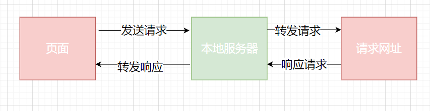

---
nav:
  title: 计算机网络
  order: 4
group:
  title: WEB安全
  order: 5
title: 同源策略
order: 1
---
# 同源策略

**同源策略**限制从一个源加载的文档或脚本如何与来自另一个源的资源进行交互，这是一个用于隔离潜在恶意文件的关键的安全机制。

同源策略满足以下三个方面：

- 同协议
- 同域名/主机
- 同端口

以 `http://www.a.com` 为例

- `http://www.a.com/foo` 同源
- `http://a.com/foo` 不同源（域名不同）
- `http://a.edu/foo` 不同源（域名不同）
- `http://b.a.com/foo` 不同源（域名不同）
- `http://a.com:81/foo` 不同源（端口不同）
- `https://a.com/foo` 不同源（协议不同）

如果非同源，则以下行为会受影响

- Cookie、LocalStorage 和 IndexDB 无法读取
- DOM 无法获取
- AJAX 请求不能发送，会产生跨域

**为什么要实现跨域请求？**

工程服务化后，不同职责的服务分散在不同的工程中，往往这些工程的域名是不同的，但一个需求可能对应到多个服务，这时便需要调用不同服务的接口，因此会出现跨域。

有时候我们的接口数据也不一定和我们部署的页面在统一服务器上。

同源策略仅出现在**游览器**环境下，其他环境如服务端，小程序等均不受影响。

**注意**：跨域请求是能够正确的发送的，服务器也是能正确的响应的，只是被游览器所拦截了。

## 跨域网络请求

严格来说，游览器并非拒绝所有不同源的交互。

- 通常游览器允许我们像其他源进行跨域写操作，比如**表单提交**等
- 通常游览器允许嵌入**跨域资源**，如``、`<script>`标签
- 通常浏览器不允许跨域 **读操作**（Cross-origin reads），但常可以通过内嵌资源来巧妙地进行读取访问。例如可以读取嵌套图片的高度和宽度，调用内嵌脚本的方法

## 解决方案

- CORS跨域资源请求
- 服务端代理请求转发
- Nginx反向代理
- JSONP
- window.postMessage
- document.domain + iframe
- window.location.hash + iframe
- window.name + iframe

### CORS

CORS亦为跨域资源共享，是一种HTTP机制。它使用额外的HTTP响应头部告诉游览器让其运行在一个`origin`上的Web应用允许访问来自**不同服务器**的资源。当一个资源向一个不同的**域、协议、端口**发起请求，资源则会发起一个**HTTP跨域请求**。

值得注意的是，通常使用 CORS 时，异步请求会被分为**简单请求**和**非简单请求**，非简单请求的区别是会先发送一个 **预检请求**（Preflight Request）。

**服务器预检请求 / 响应头**

| 响应头                             | 描述                                                         |
| ---------------------------------- | ------------------------------------------------------------ |
| `Access-Control-Allow-Headers`     | 请求头，响应头，预请求（携带 Cookie 情况下不能为 `*`）       |
| `Access-Control-Allow-Methods`     | 请求头，响应头，预请求（携带 Cookie 情况下不能为 `*`）       |
| `Access-Control-Allow-Origin`      | 响应头，预请求 / 正常请求（携带 Cookie 情况下不能为 `*`）    |
| `Access-Control-Allow-Credentials` | 响应头，预请求/正常请求（携带 Cookie 情况下要设置为 `true`） |
| `Access-Control-Max-Age`           | 响应头，预请求（单位 `s`）                                   |

`Access-Control-Allow-Origin` 只能阻止浏览器端拿到服务器返回数据，服务端的处理还是会执行，要配合 `token` 鉴权令牌等策略来防范。

#### 实现

- CORS的实现依赖于你的服务器的环境配置。
- CORS实现同时也依赖你的所使用的语言服务的配置。

#### 关于 Cookie 问题

要传递 Cookie 需要满足三个条件：

1. Web 请求设置 `withCredentials`

   这里默认情况下在跨域请求，浏览器是不带 Cookie 的。但是我们可以通过设置 `withCredentials` 来进行传递 Cookie。

   ```js
   // 原生 XMLHttpRequest 的设置方式
   const xhr = new XHRHttpRequest();
   xhr.withCredentials = true;
   // Axios 设置方式
   axios.default.withCredentials = true;
   ```

2. ``Access-Control-Allow-Credentials` 为 `true`

3. Access-Control-Allow-Origin` 为非 `*`

这里的请求方式，在 Chrome 中是能看到返回值的，但是只要不满足以上其一，浏览器会报错，无法获取数据。

### 服务端代理

原理：实质上是让我们的页面和我们本地的服务端同源，然后我们可以通过服务端请求跨域的资源接口，由于服务端并不会有同源策略问题，所以不会发生跨域。

这里更多的相当于是一个请求转发的操作。



Nginx 可实现用于反向代理的异步 Web 服务器，他除了用于反向代理以外还可以用于负载均衡、 HTTP 缓存。

```nginx
http {
  include               mime.types;
  default_type          application/octet-stream;
  client_max_body_size  2000M;
  keepalive_timeout     65;

  # 虚拟服务器
  server {
    listen       8080;
    server_name  localhost;

    # CORS 设置
    # 指定响应资源是否允许与给定的 origin 共享
    add_header Access-Control-Allow-Origin *;
    # 配置是否允许将对请求的响应暴露给页面
    add_header Access-Control-Allow-Credentials 'true';
    # 配置允许跨域的请求头
    add_header Access-Control-Allow-Headers 'Authorization,Content-Type,Accept,Origin,User-Agent,Cache-Control,X-Mx-ReqToken,X-Requested-With';
    # 配置允许跨域的请求方法
    add_header Access-Control-Allow-Methods 'GET,POST,Options';

    # 跳过服务端校验，直接返回 200
    if ($request_method = 'OPTIONS') {
      return 200;
    }

    location / {
        root        /data/example/dist;
        index       index.html index.htm;
        try_files   $uri /index.html;
        add_header  Cache-Control "private, no-store, no-cache, must-revalidate, proxy-revalidate";
    }

    location /api/ {
        proxy_pass  https://xxx.xxx.xxx/req/;
    }
  }
}
```

- 对于简单请求，如 GET，只需要在 HTTP Response 后添加 Access-Control-Allow-Origin
- 对于非简单请求，如 POST、PUT、DELETE 等，浏览器会分两次应答。第一次 Preflight（`method: OPTIONS`），主要验证来源是否合法，并返回允许的 `Headers` 等；第二次才是真正的 HTTP 应答，所以服务器必须处理 `OPTIONS` 应答。

### JSONP

**实现原理**

动态创建 `<script>` 脚本标签，通过跨域脚本嵌入不受同源策略限制的方法实现请求第三方服务器数据内容。除了适用于 `<script>` 脚本标签，HTML 中包含 `src` 和 `href` 属性的标签均不受同源策略限制。

**实现步骤**

1. 动态创建 `<script>` 标签
2. 标签 `src` 属性设置接口地址
3. 接口参数，必须要带一个自定义函数名，要不然后台无法返回数据，通常为 `callback` 或 `cb`
4. 通过定义函数名去接收后台返回数据

前端实现：

```js
// 动态创建脚本标签
const script = document.createElement('script');

// 设置接口地址
script.src = 'http://localhost:8080/api/jsonp?cb=jsonpCallback';

// 插入页面
document.appendChild(script);

// 通过定义回调函数接收响应数据
window.jsonpCallback = function(res) {
  // do something with response data
};
```

由于 `<script>` 元素请求的脚本，直接作为代码运行。这时，只要浏览器定义了回调函数，该函数就会立即调用。作为参数的 JSON 数据被视为 JavaScript 对象，而不是字符串，因此避免了使用 `JSON.parse` 的步骤。

**缺点**：

- 非常高的跨站脚本攻击风险
- 只能实现 GET 请求
- 接口出现错误时，很难进行错误识别处理

### window.postMessage

通常，对于两个不同页面的脚本，只有当执行它们的页面位于具有相同的协议（通常为 HTTPS），端口号（443 为 HTTPS 的默认值），以及主机（两个页面的模数 `document.domain` 设置为相同的值）时，这两个脚本才能相互通信。`window.postMessage` 方法提供了一种受控机制来规避此限制，只要正确的使用，这种方法就很安全。

`window.postMessage(message, targetOrigin)` 方法是 HTML5 新引进的特性，可以使用它向其他的 `window` 对象发送消息，无论这个 `window` 对象是属于同源或不同源，目前 IE8+、Firefox、Chrome、Opera 等浏览器都已经支持该方法。

**用途：**

1. 页面和其打开的新窗口的数据传递
2. 多窗口之间消息传递
3. 页面与嵌套的 iframe 消息传递

```js
otherWindow.postMessage(message, targetOrigin, [transfer]);
```

- `otherWindow`：其他窗口的一个引用，比如 iframe 的 `contentWindow` 属性、执行 `window.open` 返回的窗口、或者是命名过或数值索引的 `window.iframes`
- `message`：将要发送到其他 `window` 的数据
- `targetOrigin`：通过窗口的 `origin` 属性来指定哪些窗口能接收到消息事件
- `transfer`（可选）：是一串和 `message` 同时传递的 Transferable 对象，这些对象的所有权将被转移给消息的接收方，而发送一方将不再保有所有权

发送端页面：

```html
<iframe id="iframe" src="http://localhost:8080/" frameborder="0" onload="load()"></iframe>
<script type="application/javascript">  function load() {    iframe.contentWindow.postMessage('Hello world!', 'http://localhost:8080/');
    window.onmessage = e => {      console.log(e.data);    };  }</script>
```

接收端页面：

```html
<div></div>
<script type="application/javascript">
  window.onmessage = e => {
    console.log(e.data);
    // Hello world!
    e.source.postMessage(e.data, e.origin);
  };
</script>
```

💡 实现细节请参考 [PostMessage](https://tsejx.github.io/javascript-guidebook/browser-object-model/connectivity/post-message)

### document.domain + iframe

Cookie 是服务器写入浏览器的一小段信息，只有同源的网页才能共享。

但是，两个网页一级域名相同，只是二级域名不同，浏览器只需要设置 `document.domain` 为更高级别的域就能实现 Cookie 共享。

🌰 **标准示例**

以 `a.foo.com` 和 `b.foo.com` 为例，只要设置相同的 `document.domain`，两个网页就可以共享 Cookie。

```js
document.domain = 'foo.com';
```

⚠️ **注意**：这种方法只适用于 Cookie 和 iframe 窗口，localStorage 和 IndexDB 无法通过这种方法，规避同源策略，需要采用下文提及的 [PostMessage API](https://tsejx.github.io/javascript-guidebook/computer-networks/web-security/same-origin-policy#postMessage)。

另外，服务器也可以在设置 Cookie 的时候，指定 Cookie 的所属域名为一级域名。

```http
Set-Cookie: key=value; domain=.example; path=/
```

那么，二级域名和三级域名不用做任何设置，都可以读取这个 Cookie。

## 阻止跨源访问

- 阻止跨域写操作，只要检测请求中的一个不可测的标记（CSRF token）即可，这个标记被称为 [Cross-Site Request Forgery (CSRF)](https://www.owasp.org/index.php/Cross-Site_Request_Forgery_(CSRF)) 标记。必须使用这个标记来阻止页面的跨站读操作。
- 阻止跨站嵌入，需要确保你的资源不能是以上列出的可嵌入资源格式。多数情况下浏览器都不会遵守 `Content-Type` 消息头。例如，如果您在 HTML 文档中指定 `<script>` 标记，则浏览器将尝试将 HTML 解析为 JavaScript。 当您的资源不是您网站的入口点时，您还可以使用 CSRF 令牌来防止嵌入。
- 阻止资源的跨站读取，需要保证该资源是不可嵌入的。阻止嵌入行为是必须的，因为嵌入资源通常向其暴露信息。