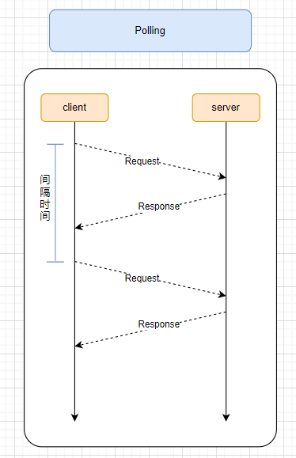
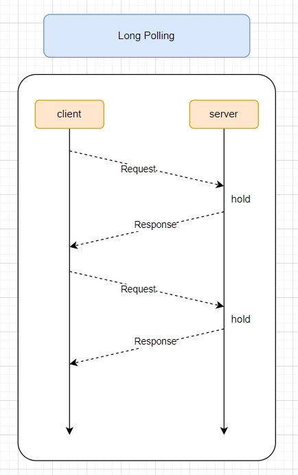
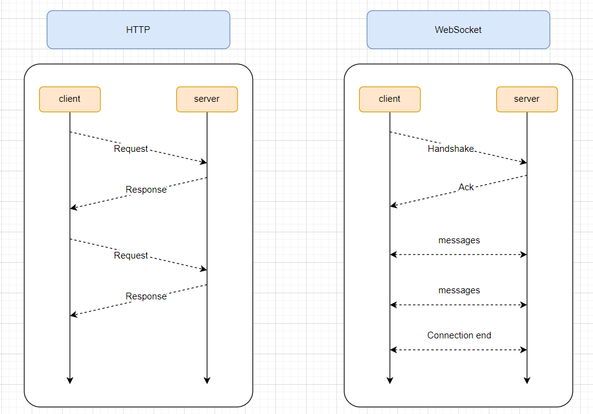

---
nav:
  title: 计算机网络
  order: 4
group:
  title: WebSocket
  order: 6
title: 概述
order: 1
---

# `WebSocket` 概述

`WebSocket`是一种网络通信协议，可在单个`TCP`连接上进行`全双工`的通信，位于`OSI模型`的应用层。

## 为什么需要`WebSocket`

实际上，在我们的平时工作中用到比较多的可能是`HTTP`协议，那我们为什么还需要另外的协议？他带来了什么好处。

首先，我们来看`HTTP`协议的特点吧？**通信只能由客户端发起.**

这就说明了，如果我们使用`HTTP`协议的话，那我们只是客户端主动给服务端发送请求，等待服务端的响应。服务端不能主动的推送信息给客户端。

`Problems with HTTP`
- One-way(client -> server)
- request/response
- stateless
- Half-Duplex protocol

这种单向的请求的特点，会导致在某些场景下，客户端要获取信息就比较麻烦。之前，大多采用的都是`轮询`的方案（一般情况下是消耗挺多资源的）。

### 短轮询(Polling)

短轮询的实习思路就是在客户端不断间隔的发送`HTTP`请求，以拿到最新的数据响应。实现也非常简单，我们只需要去实现一个定时器，去进行请求即可。下方是`setInterval`的思路。



```js
function fetchApi() {
  return request('https://xxxxxx/com/api');
}

setInterval(() => {
  fetchApi();
}, 2000);
```

- 优点： 实现简单
- 缺点： 会存在又大量无效的请求，浪费资源。

### 长轮询(Long-Polling)

客户端发送请求后，服务端并不会返回数据，服务端会阻塞请求连接并不立即断开，直到**服务器有数据更改推送**或者**连接超时**才返回，客户端在其请求新建连接，反复获取最新数据。



代码如下
```js
function fetchApi() {
  request(url).then(res => {
    // handle success
  }).catch(err => {
    // handle error
  }).finally(() => {
    fetchApi();
  });
}
```

- 优点：比 Polling 做了优化，有较好的时效性。
- 缺点：保持连接挂起会消耗资源，服务器没有返回有效数据，程序超时。

轮询的效率是比较低的，非常浪费资源（不停的连接，`HTTP`始终打开）。于是,`WebSocket`就发明了。

## 简介

WebSocket协议诞生于2008，于2011成为国际的标准。

特点： 服务端和客户端可以互相推送信息，实现双向平等的堆化，属于服务器推送的一种。



特点包括

1. 建立在`TCP`协议之上，服务器端的实现比较容易。
2. 与`HTTP`协议有着良好的兼容性，默认端口`80`和`443`,并且握手阶段采用`HTTP`协议，因此握手时不容易屏蔽，能通过各种`HTTP`代理服务器。
3. 数据格式比较轻量、性能开销小、通信高效。
4. 可以发送文本，也可以发送二进制数据。
5. 没有同源的限制，客户端可以与任何服务器通信。
6. 协议标识符是`ws`,(如果加密，则为`wss`),服务器网址就是`URL`.
   
```text
ws://example.com:80/some/path
```

## 例子

在这里，我们使用游览器的`WebSocket Api`能力，来实现以下一个简单的例子。
(使用的ws服务地址为: ws://121.40.165.18:8800)

```tsx
import React, { useState, useEffect } from 'react';

function initWSConnect(fn?: (data: any) => void) {
  const url = 'ws://82.157.123.54:9010/ajaxchattest';

  // Connect to ws
  const socket = new WebSocket(url);

  // Connection opened
  socket.addEventListener('open', function (event) {
    socket.send('Hello Server!');
  });

  // Listen for messages
  socket.addEventListener('message', function (event) {
    console.log('Message from server ', event.data);
    fn && fn(event.data);
  });

  return socket;
}

const Demo = () => {

  const [value, setValue] = useState('');  
  const [messageList, setMessageList] = useState<string[]>([]);
  const [socket, setSocket] = useState<any>();

  const logFn = (data: any) => {
    setMessageList(prev => [...prev, data]);
  }

  const handleInputChange = (e) => {
    const { value: val } = e.target;
    setValue(val);
  }

  const send = () => {
    socket && socket.send(value);
    setValue('');
  }

  const connect = () => {
    const ws = initWSConnect(logFn);
    setSocket(ws);
  };

  return (
    <div style={{ width: '100%', display: 'flex' }}>
      <div style={{ flex: 1 }}>
        <h3>
          Client 
          { 
            socket ? 
              'connected' : (
                <>
                  no connect, please click 
                  <button style={{ marginLeft: '10px' }} onClick={connect}>connect</button>
                </>
              )
          }
        </h3>
        <div>
          <input value={value} onChange={handleInputChange} />
          <button onClick={send}>send</button>
        </div>
      </div>
      <div style={{ flex: 1 }}>
        <h3>Server</h3>
        <div>
          { messageList.map(item => (<div key={item}>{item}</div>)) }
        </div>
      </div>
    </div>
  );
}

export default Demo;
```


## 参考

- [WebSocket 教程](http://www.ruanyifeng.com/blog/2017/05/websocket.html)

- [WebSocket 原理浅析与实现简单聊天 - 掘金 (juejin.cn)](https://juejin.cn/post/6844904001654226958#heading-2)