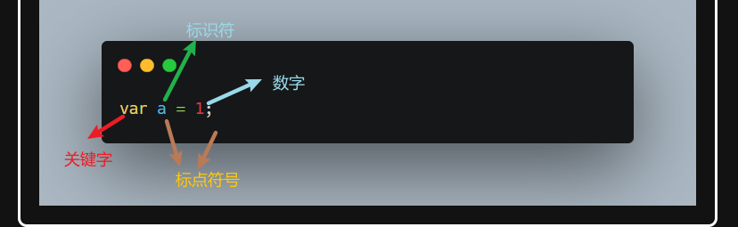
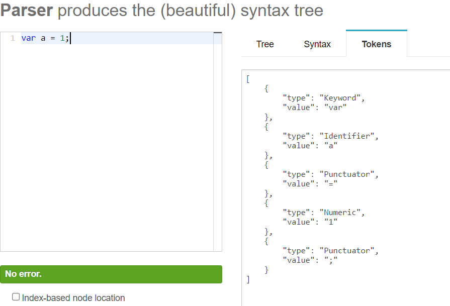
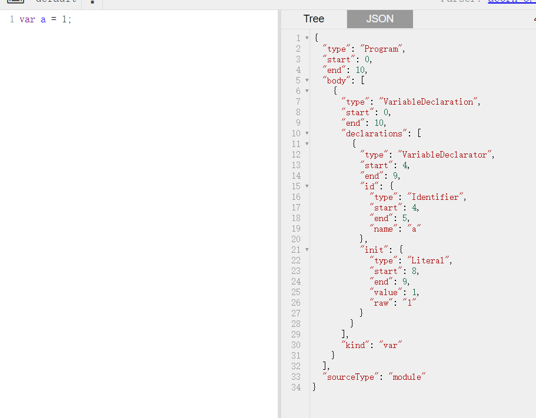

---
nav:
  title: 核心知识
  order: 3
group:
  title: 编译阶段
  order: 2
title: 编译阶段
order: 1
---

# 编译阶段

## 编译原理

JavaScript是一门编译语言。但与传统编译语言不同的是，JavaScript不是提前**编译**的，编译结果不能再分布式系统中移植。

### 编译阶段

对于常见编译型语言（例如：`Java` ）来说，编译步骤分为：词法分析 -> 语法分析 -> 语义检查 -> 代码优化和字节码生成。

对于解释型语言（例如：`JavaScript` ）来说，编译阶通过词法分析 -> 语法分析 -> 代码生成，就可以解释并执行代码了。

`JavaScript`执行分为**编译阶段**和**执行阶段**

在编译流程中，`js`做了三件事，程序的源代码会经过三个步骤，统称**编译**：

- 分词/词法分析
- 解析/词法分析
- 代码生成

### 分词和词法分析

**词法分析**(Tokenizing/ Lexing)这个过程会在字符串分解成有意义的代码块，这些代码块被称为词法单元 。

```js
var a = 1;
```







从上图我们看出，这段程序会被分解为: `var`、`a`、`=`，`2`、`;`

每个词法单元不可以再分隔。

**注**：空格是否会被当作词法单元，取决于空格在这门语言中是否具有意义。

**分词**(Tokenizing)和**词法分析**(Lexing)之间的主要差异在于词法单元的是通过有状态还是无状态的方式进行。

简单来说，如果词法单元生成器在判断 `a` 是一个独立的词法单元还是其他词法单元的一部分时，调用的是**有状态的解析规则**，那么这个过程就被称为**词法分析**。

### 解析和语法分析

**语法分析**(Parsing)这个过程会将词法单元流(数据),也就是上面的`token`转换成一个有元素逐级嵌套所组成的程序语法结构的数，我们称它为**抽象语法树**(Abstract Syntax Tree, AST)



### 代码生成

将AST树转换成可执行代码的过程叫做**代码生成**。这个过程与语言，平台，运行环境是相关的。总得来说，因为计算机只识别机器指令，而代码生成这个过程，就是将`var a = 1;`转成机器指令：在内存中，创建变量`a`，并在1这个值存放在变量a中。

通过以上三个阶段，我们就得到**可执行代码**，这三步骤统称**编译**。之后得**可执行代码**的执行我们称为**可执行阶段**。

## 编译过程

编译过程中的关键角色：

- **引擎：** 从头到尾负责整个 JavaScript 程序的编译及执行过程
- **编译器：** 负责语法分析及代码生成的步骤。
- **作用域：**负责收集并维护由所有声明的标识符（变量）组成的一系列查询，并实施一套非常严格的规则，确定当前执行的代码对这些标识符的访问权限

### 作用域

作用域就是变量(标识符使用范围),控制着变量可见性。

《You don‘t know js》对作用域的定义：

> 使用一套严格的规则来分辨哪些标识符对那些语法有访问权限。

《JavaScript 权威指南》中对变量作用域的描述：

> 一个变量的作用域（Scope）是程序源代码中定义这个变量的区域。全局变量拥有全局作用域，在 JavaScript 代码中的任何地方都是有定义的。然而在函数内声明的变量只在函数体内有定义。它们是局部变量，作用域是局部性的。函数参数也是局部变量，它们只是在函数体内有定义。

### 编译过程详解

```js
var a = 2;
```

通过以上论述可以得知，编译器首先会将这段代码分解成词法单元，然后将词法单元解构成一个树结构（AST），但是当编译器开始进行代码生成时，它对这段代码的处理方式会和预期的情况有所不同。

当我们看到这行代码，用伪代码与别人进行概括时，可能会表述为：为一个变量分配内存，并将其命名为变量 `a`，然后将值 2 保存到这个变量（内存）中。

然而，并非完全正确。

**事实上编译器会进行如下操作：**

1. 执行遇到`var a`,编译器会询问作用域在同一作用域是否存在一个该名称的变量。如果是，编译器会忽略该声明，继续编译；否则它会要求作用域在当前作用域的集合中声明一个新的变量，并命名为`a`。
2. 接下来编译器会为引擎生成运行所需的代码，这些代码被用来处理 `a = 2` 这个赋值操作。引擎运行时会首先询问作用域，在当前的作用域集合中，是否存在一个叫作 `a` 的变量，如果是，引擎就会使用这个变量；如果否，引擎就会继续查找该变量。

**总结**：

- 如果本来不存在相关变量，编译器在作用域中声明变量
- 引擎在运行这些代码时查找该变量，如果作用域中有该变量则进行赋值

在上面的第二步中，引擎执行运行时所需的代码时，会通过查找变量 `a` 来判断它是否已经声明过。查找的过程由作用域进行协助，但是引擎执行怎么查找，会影响最终的查找结果。

`var a = 2`; 这个例子，引擎会为变量 `a` 进行 LHS 查询。当然还有一种 RHS 查询。

### LHS和RHS查询

这里的 L 代表左侧，R 代表右侧。通俗且不严谨的解释 LHS 和 RHS 的含义就是：

- 当变量出现赋值操作则进行LHS查询。
- 出现在右侧（读取操作）进行RHS查询。

那么描述的更准确的一点

- RHS 查询与简单的查找某个变量的值毫无二致，而
- LHS 查询则是试图找到**变量的容器本身**，从而可以对其赋值。

从这个角度说，RHS 并不是真正意义上的"赋值操作的右侧"，更准确的说是"非左侧"。所以，我们可以将 RHS 理解成 Retrieve his source value（取到它的源值），这意味着，"得到某某的值"。

```js
function foo(a) {
  console.log(a)
}

foo(2)
```

- 在`console.log(a)`,变量做的是一个读取值的操作，所以这里对变量`a`的引用是一个**RHS**的引用。
- 相比之下, 我们看看函数的形参，但我们调用函数的时候，其实我们进行了一个赋值操作。这里对`a`的引用就是**LHS**引用。

LHS 和 RHS 的含义是 **赋值操作的左侧或右侧** 并不一定意味着就是 `= 赋值操作符的左侧或右侧`。

更重要的是我们要理解**赋值操作的目标是谁(LHS)**和**谁是赋值操作的源头(RHS)**

我们对上面的进行详细分析

```js
function foo(a) {
	// 这里隐式进行了对a的LHS引用
    
    // 对log进行了RHS引用
    // 这里隐式进行了对a的RHS引用
    console.log(a)
}

// foo这里是RHS引用
foo(2);
```

需要注意的是：我们经常会将函数声明 `function foo(a) {...} `转化为普通的变量赋值（函数表达式） `var foo = function(a) {…}`，这样去理解的话，这个函数是 LHS 查询。但是有一个细微的差别，编译器可以在代码生成的同时处理声明和值的定义，比如引擎执行代码时，并不会有线程专门用来将一个函数值"分配给" `foo`，因此，将函数声明理解成前面讨论的 LHS 查询和赋值的形式并不合适。

综上所述，作用域是一套**标识符的查询规则**，JavaScript 编译引擎执行时根据查找的目的进行 LHS 与 RHS 查询。这套查询规则确定标识符在何处（当前作用域、上层作用域或全局作用域）以及如何查找（LHS、RHS）。

---

**参考资料**：

- [编译阶段](https://tsejx.github.io/javascript-guidebook/core-modules/executable-code-and-execution-contexts/compilation/compilation)

- [深入了解JavaScript执行过程（JS系列之一）](https://juejin.cn/post/6844904089449414670)
