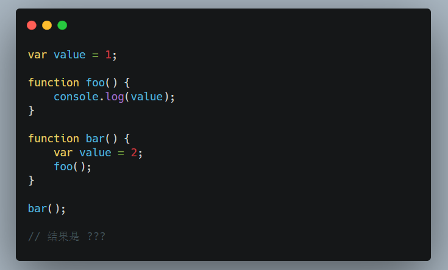
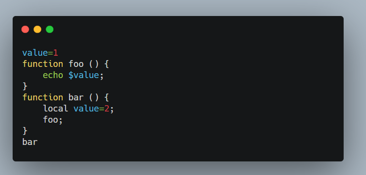

---
nav:
  title: 核心知识
  order: 3
group:
  title: 编译阶段
  order: 2
title: 词法作用域
order:2
---

# 词法作用域

## 作用域

作用域是指程序源代码中定义变量的区域。

作用域规定了如何查找变量，也就是确定当前执行代码对变量的访问权限。

JavaScript采用**词法作用域**(lexical scoping), 也就是静态作用域。

## 词法作用域和动态作用域

JavaScript采用的是**词法作用域**，函数的作用域在函数定义的时候就决定了。

而与词法作用域相对的是动态作用域，函数的作用域是在函数调用的时候所决定的。

## 词法作用域

大部分标准语言的编译器的第一个工作叫做**词法化**。词法化的过程会对源代码的字符进行检查，如果有状态的解析过程，还会进行赋予单词语义。

简答来说，词法作用域就是定义在词法阶段的作用域。

换句话来说，词法作用域是由你在写代码时将变量和块作用域写在哪里来决定的，因此当词法分析器处理代码时会保持作用域不变（大部分情况下时这样的）。

**举个例子😊**

```js
var value = 1;

function foo() {
    console.log(value);
}

function bar() {
    var value = 2;
    foo();
}

bar();

// 结果是 ???
```



熟悉JS的同学，可能比较清楚，答案就是1

**我们从词法作用域的角度，进行分析**:

- 执行foo函数，我们找到foo函数内部有没有value值，如果有则输出。
- 没有的话，会根据书写位置，向外层找一层代码，也就是value为1，即全局中的value，所以结果打印了1。

**我们从动态作用域，进行分析**：

- 执行foo函数，我们找到foo函数内部有没有value值，如果有则输出。
- 没有的话，会根据调用位置的作用域找变量，也就是value为1，即全局中的value，所以结果打印了2。

JavaScript采用**词法作用域**，我们很容易看出结果。

我们再分析一下foo的作用域

- 包含自身的作用域，不过foo中没有定义变量
- 包含全局作用域，能访问value和bar的变量和函数。

每个函数都会创建自己的一个作用域，并且他能访问它所定义的位置的外层的作用域。

### 查找

作用域结构和相互的位置关系给引擎提供位置信息，引擎利用这些信息查找对应的**标识符**。

在上述代码中，引擎执行`console.log(value)`，回去查找value的引用。

- 首先从调用的作用域，即最内部的作用域开始，即foo函数的作用域开始查找。
- 引擎在这作用域中无法找到`value`，因此到上一层的全局作用域中找到value的引用。
- 当找到最近的引用时，引擎便停止对这个数的查找，直接返回了。

### 遮蔽

**作用域查找会在找到第一个匹配的标识符时停止。**

我们在编码的过程中，允许多层嵌套作用域中声明同名标识符，这时候会产生**遮蔽效应**(内部的标识符遮蔽了外部的标识符)。

即作用域在从内部往外部查找标识符的时候，遇到第一个标识符即停止。

全局变量会自动成为全局对象的属性（比如浏览器中的 Window 对象），因此可以不直接使用全局对象的词法名称，而是间接地通过对全局对象属性的引用来对其进行访问。

```js
window.a
```

通过这种技术可以访问那些被同名变量所遮蔽的全局变量。但非全局的变量如果被遮蔽了，无论如何都无法被访问到。

**函数无论在哪里被调用，也无论它如何被调用，它的词法作用域都只有函数被声明所处的位置决定！**

词法作用域查找只会查找一级标识符，比如 `a`、`b` 和 `c`。如果代码中引用了 `foo.bar.baz`，词法作用域查找只会试图查找 `foo` 标识符，找到这个变量后，对象属性访问规则会分别接管对 `bar` 和 `baz` 属性的访问。

## 动态作用域

词法作用域最重要的特征是它的定义过程发生在代码的书写阶段。

而动态作用域则是在代码的执行阶段。

实际上动态作用域是 JavaScript 另一个重要机制 [this](https://tsejx.github.io/javascript-guidebook//core-modules/executable-code-and-execution-contexts/execution/this) 的表亲。作用域混乱多数是因为词法作用域和 `this` 机制相混淆。

**动态作用域**并不关系函数和作用域是如何声明以及何处声明，只关心他们何处调用。

换句话说，作用域链是基于**调用栈**的，而不是代码中的作用域嵌套。

```bash
value=1
function foo () {
    echo $value;
}
function bar () {
    local value=2;
    foo;
}
bar	#2
```



两种作用域的区别，简而言之，词法作用域是在**定义**时确定的，而动态作用域是在**运行**时确定的

---

**参考资料**：

- [词法作用域](https://tsejx.github.io/javascript-guidebook/core-modules/executable-code-and-execution-contexts/compilation/lexical-scope/#%E8%AF%8D%E6%B3%95%E4%BD%9C%E7%94%A8%E5%9F%9F)

- [JavaScript深入之词法作用域和动态作用域](https://github.com/mqyqingfeng/Blog/issues/3)