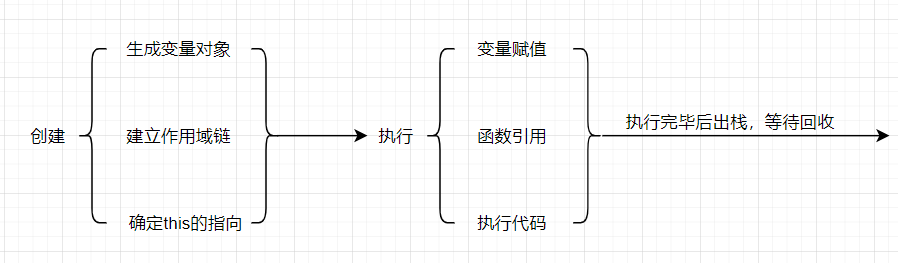
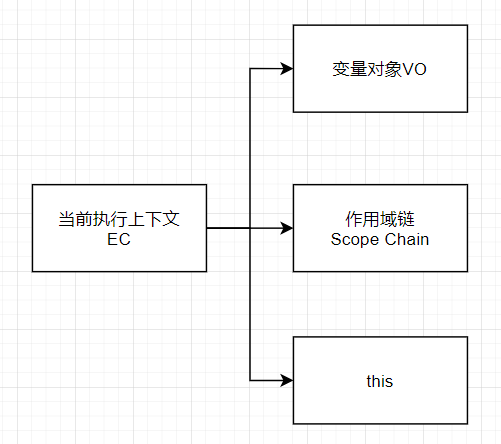

---
nav:
  title: 核心知识
  order: 3
group:
  title: 执行阶段
  order: 3
title: 执行上下文
order: 1
---
# 执行上下文



当我们调用一个函数的时候，一个执行上下文就被创建了。

一个执行上下文的声明周期分为**创建阶段**和**可执行阶段**这两个阶段。

**创建阶段**：在这个阶段，执行上下文的操作

- 创建**变量对象**
- 建立**作用域链**
- 确定**this的指向**

**代码执行阶段**：创建完成之后，就会开始执行代码，并依次完成以下步骤

- 变量赋值
- 函数引用
- 执行其他代码



## 可执行代码

每次当控制器转到可执行代码的时候，就会进入一个执行上下文。

执行上下文可以理解为当前代码的执行环境，它会形成一个作用域。

JavaScript 中的运行环境大概包括三种情况：

- **全局环境**： JavaScript 代码运行起来会首先进入该环境
- **函数环境**：当函数被调用的时候，会进入函数中执行代码
- **eval**

在JavaScript中，会产生多个执行上下文，JavaScript使用栈来处理他们，实现后进先出，这个栈，我们称为**函数调用栈**。栈底是全局上下文，栈顶是当前的执行上下文。

当代码在执行过程中，遇到以上三种情况，都会生成一个执行上下文，放入栈中，而处于栈顶的上下文执行完毕之后，就会自动出栈。

## 栈堆实现分析

JavaScript 引擎通过创建 **执行上下文栈（Execution Context Stack，ECS）** 用于管理执行上下文。

我们这里进行调用的模拟。

初始化时，程序还没有开始执行

```js
ECS = [];
```

当我们的程序开始执行的时候，首先进栈的时全局执行上下文,`globalContext`来表示，并且只有当整个应用程序结束的时候，ECStack 才会被清空，所以**程序结束之前**， ECStack 最底部永远有个 `globalContext`。

```
ECS = [globalContext];
```

假设我们执行的代码如下

```js
function fun3() {
  console.log('fun3');
}

function fun2() {
  fun3();
}

function fun1() {
  fun2();
}

fun1();
```

当执行一个函数的时候，就会创建一个执行上下文，并且压入执行上下文栈，当函数执行完毕的时候，就会将函数的执行上下文从栈中弹出。

知道了这样的工作原理，让我们来看看如何处理上面这段代码：

```js
// fun1();
ECStack.push(<fun1>functionContext);

// fun2();
ECStack.push(<fun2>functionContext);

// fun3();
ECStack.push(<fun3>functionContext);

// fun3执行完毕
ECStack.pop();

// fun2执行完毕
ECStack.pop();

// fun1执行完毕
ECStack.pop();
```

详细了解了这个过程之后，我们就可以对 **执行上下文栈** 总结一些结论了。

- 单线程
- 栈底是全局上下文执行栈，栈顶是当前的上下文执行栈
- 全局上下文只有唯一的一个，它在浏览器关闭时出栈
- 同步执行，只有等栈顶的上下文出栈，其他的上下文才能执行。
- 每次某个函数被调用，就会有个新的执行上下文为其创建，即使是调用的自身函数，也是如此