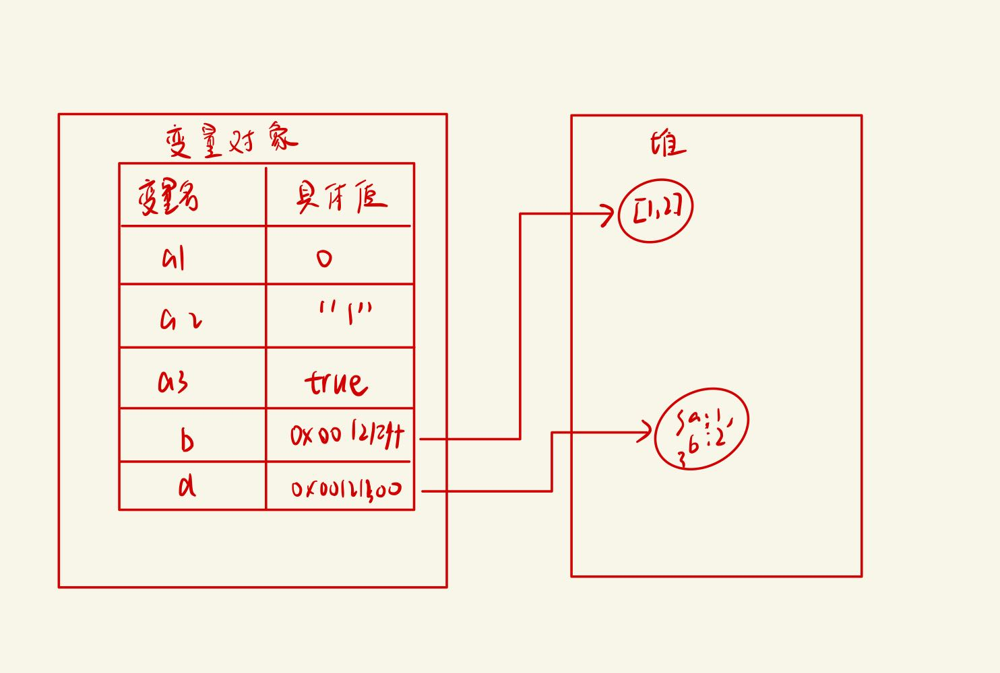

---
nav:
  title: 核心知识
  order: 3
group:
  title: 内存管理
  order: 4
title: 内存模型
order: 1
---
# 内存模型

## 简介

像C语言这样的底层语言一般都有底层的内存管理接口，比如 `malloc()`和`free()`。相反，JavaScript是在创建变量（对象，字符串等）时自动进行了分配内存，并且在不使用它们时“自动”释放。 释放的过程称为垃圾回收。这个“自动”是混乱的根源，并让JavaScript（和其他高级语言）开发者错误的感觉他们可以不关心内存管理。 

### 内存声明周期

不管什么语言，内容生命周期基本是一致的：

1. 分配内存
2. 使用分配到的内存(读、写)
3. 不需要使用时候释放内存

所有语言第二部分都是明确的。第一和第三部分在底层语言中是明确的，但在像JavaScript这些高级语言中，大部分都是隐含的。

### JavaScript的内存分配

JavaScript内存空间主要分为堆(heap)、栈(Stack)、池（一般也会归类为栈中）。其中**栈**存放变量，**堆**存放复杂对象，**池**存放常量。

## 栈数据结构

与 C / C++ 不同，JavaScript 中并没有严格意义上区分栈内存与堆内存。因此我们可以简单粗暴的理解为 JavaScript 的所有数据都保存在堆内存中。但是在某些场景，我们仍然需要基于堆栈数据结构的思维来实现一些功能，比如 JavaScript 的 [执行上下文](https://tsejx.github.io/javascript-guidebook/core-modules/executable-code-and-execution-contexts/execution/execution-context-stack)。执行上下文的执行顺序借用了栈数据结构的存取方式。

要简单理解栈的存取方式，我们可以通过类比乒乓球盒子来分析


**特点： 后进先出**

## 堆数据结构

堆数据结构是一种树状结构。它的存取数据的方式，则与书架与书非常相似。

书虽然也整齐的存放在书架上，但是我们只要知道书的名字，我们就可以很方便的取出我们想要的书，而不用像从乒乓球盒子里取乒乓一样，非得将上面的所有乒乓球拿出来才能取到中间的某一个乒乓球。好比在 JSON 格式的数据中，我们存储的 `key-value` 是可以无序的，因为顺序的不同并不影响我们的使用，我们只需要关心书的名字。

## 队列数据结构

队列是一种先进先出（FIFO）的数据结构。正如排队过安检一样，排在队伍前面的人一定是最先过检的人。用以下的图示可以清楚的理解队列的原理。


**特点：先进先出**

**例子：排队**

## 变量对象与基础数据类型

JavaScript 的 [执行上下文](https://tsejx.github.io/javascript-guidebook/core-modules/executable-code-and-execution-contexts/execution/execution-context-stack) 生成之后，会创建一个叫做 [变量对象](https://tsejx.github.io/javascript-guidebook/core-modules/executable-code-and-execution-contexts/execution/variable-object) 的特殊对象，JavaScript 的基础数据类型往往都会保存在变量对象中。

严格意义上来说，变量对象也是存放于堆内存中，但是由于变量对象的特殊职能，我们在理解时仍然需要将其于堆内存区分开来。

JavaScript的基本数据结构，都有特定的大小，往往保存在栈内存中，由系统自动分配存储空间。我们可以直接操作保存在栈内存中的值。

基础数据类型都是**按值访问**，数据在栈内存中存储与使用方式类似于数据结构中的堆栈数据结构，遵循 **后进先出** 的原则。

## 引用数据类型与堆内存

与其他语言不同，JavaScript 的引用数据类型，比如数组 Array，它们值的大小是不固定的。引用数据类型的值是保存在堆内存中的对象。

JavaScript不允许直接访问堆中的值。在操作对象时，我们实际是在操作对象的引用而不是实际的对象。

引用类型都是**按引用访问**。这里的引用，我们可以粗浅地理解为保存在栈内存中的一个**引用地址**，该地址与堆内存的实际值相关联。 

```js
var a1 = 0;

var a2 = "1";

var a3 = true;

var b = [1,2]

var d = {a:1, b:2} 
```



因此当我们要访问堆内存中的引用数据类型时，实际上我们首先是从变量对象中获取了该对象的**地址引用**（或者地址指针），然后再从堆内存中取得我们需要的数据。

理解了 JavaScript 的内存空间，我们就可以借助内存空间的特性来验证一下数据类型的特点了。

## 数据拷贝

### 基本数据类型

🌰 **标准示例：**

```js
const a = 10;
const b = a;
b = 20;
```

在变量对象中数据发生拷贝操作时，系统会自动为新的变量分配一个新值。`const b = a` 赋值操作执行后，虽然变量 `a` 和变量 `b` 均为 100，但是它们其实已经是相互独立互不影响的值了。具体变化如下图所示。


### 引用数据类型

🌰 **标准示例：**

```js
const m = { a: 10, b: 20 };
const n = m;
n.a = 15;
```

引用类型的拷贝同样也会为新的变量自动分配一个新的值保存在变量对象中，但不同的是，这个新的值，仅仅只是引用类型的一个**地址指针**。当地址指针相同时，尽管他们相互独立，但是在变量对象中访问到的具体对象实际上是同一个。


## 总结

| 栈内存                   | 堆内存                   |
| ------------------------ | ------------------------ |
| 存储原始数据类型         | 存储引用数据类型         |
| 按值访问                 | 按引用访问               |
| 存储的大小由数据类型固定 | 存储的大小不定           |
| 由系统自动分配内存空间   | 由开发者通过代码进行分配 |
| 主要用来执行程序         | 主要用于存放对象         |
| 空间小，效率高           | 空间大，但效率低         |
| 先进后出，后进先出       | 无序存储，根据引用取值   |

---

**参考资料**：

- [内存模型](https://tsejx.github.io/javascript-guidebook/core-modules/executable-code-and-execution-contexts/memory-management/memory-model)
- [内存管理](https://developer.mozilla.org/zh-CN/docs/Web/JavaScript/Memory_Management)