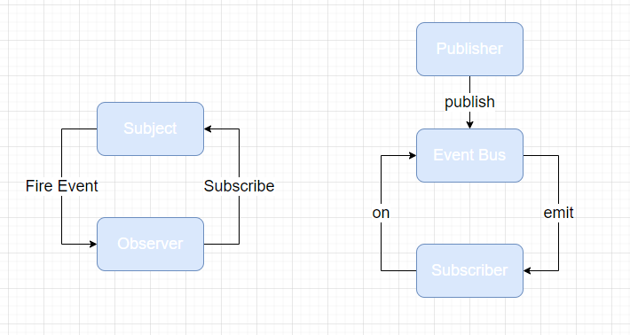

---
nav:
  title: 设计模式
  order: 5
group:
  title: 行为型
  order: 3
title: 发布订阅模式
order: 2
---
# 发布订阅模式

发布订阅模型属于广义上的观察者模式，对象中的一种一对多的依赖关系，当一个对象触发一个事件的时候，所有订阅该事件的对象将得到通知。

发布订阅模式是常用的一种观察者的模式的实现，并且从解耦和重用角度来看，更优于典型的观察者模式。



- 在观察者模式中，观察者需要直接订阅目标事件；在目标发出内容改变的事件后，直接接收事件并作出响应。
- 在发布订阅模式中，发布者和订阅者多了一个发布通道；一方面从发布者接收事件，另一方面向订阅者发布事件；订阅者需要从事件通道订阅事件。

以此避免发布者和订阅者直接产生依赖关系。

代码如下：

```js
class PubSub {
  constructor() {
    this.substribers = {};
  }

  on(type, fn) {
    this.substribers[type] = this.substribers[type] || [];
    this.substribers[type].push(fn);
  }

  off(type, fn) {
    let listeners = this.substribers[type];
    if (!listeners) {
      return;
    }
    this.substribers[type] = listeners.filter(v => v !== fn);
  }

  emit(type, ...args) {
    let listeners = this.substribers[type];
    if (!listeners) {
      return;
    }
    listeners.forEach(listener => {
      listener(...args);
    })
  }
}
```

