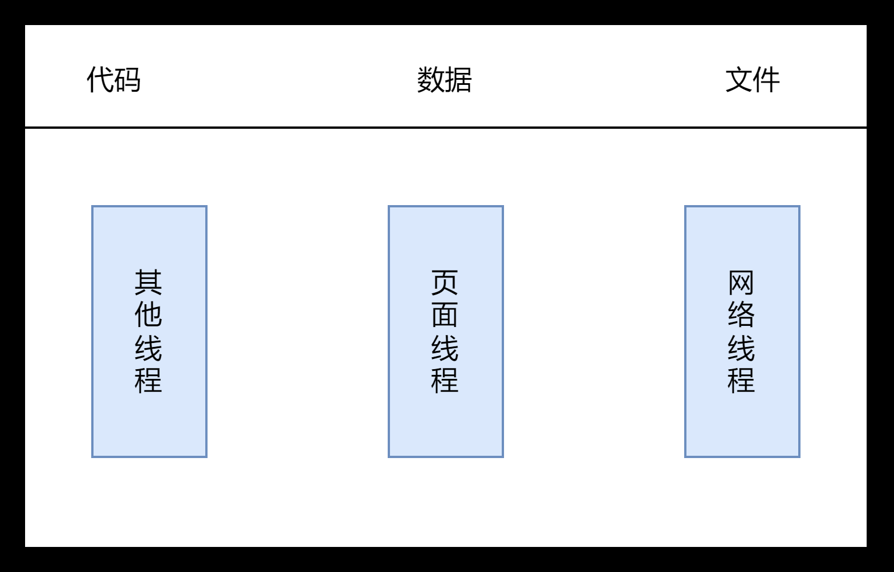

---
nav:
  title: 游览器工作原理和实践
  order: 6
group:
  title: 宏观视角下的游览器
  order: 1
title: Chrome架构
order: 1
---

# Chrome 架构: 仅仅打开一个页面，为什么有多个进程

## 引言

我们在`Chrome`打开网页，然后我们去看进行信息，我们会发现，其实有多个进程在工作。但为什么我们只打开了一个页面，却启动了这么多的进程。

我们先来明白几个概念。

## 概念

### 并行处理

计算机中的并行处理就是同一时刻处理多个任务。**并行处理大多情况下可以提升性能。**

### 进程和线程

多线程是可以并行处理任务的，但**线程是不能单独存在的，他是有进程来启动和管理的。**

#### 进程

**一个进程就是一个程序的运行实例。**当我们启动一个程序的时候，操作系统会为该程序创建一块内存，用来存放代码，运行中的数据和一个执行任务的**主线程**，我们把这样的运行环境叫进程。

从图中可以看到，**线程是依附于进程的，而进程中使用多线程并行处理能提升运算效率**。

总结来说，进程和线程之间的关系有以下 4 个特点。

1. 进程中任意线程出错，整个进程崩溃。
2. 线程之间共享进程的数据。
3. 当一个进程关闭之后，操作系统会回收进程所占用的内存。
4. 进程之前的内容相互隔离。

## 单进程游览器时代

顾名思义，**单进程游览器是指游览器的所有功能模块都在一个进程中**,包括网络、插件、JS运行环境、渲染引擎和页面等。

多个线程在一个进程之中，是导致单进程游览器**不稳定，不安全，不流畅**的一个主要因素。不

#### 问题1： 不稳定

- 插件的意外崩溃引起的游览器的崩溃。
- 渲染模块中复杂的JavaScript代码。

#### 问题2：不流畅

从上面的“单进程浏览器架构示意图”可以看出，所有页面的渲染模块、JavaScript 执行环境以及插件都是运行在同一个线程中的，这就意味着同一时刻只能有一个模块可以执行。

#### 问题3： 不安全

插件可以使用 C/C++ 等代码编写，通过插件可以获取到操作系统的任意资源，当你在页面运行一个插件时也就意味着这个插件能完全操作你的电脑。如果是个恶意插件，那么它就可以释放病毒、窃取你的账号密码，引发安全性问题。

### 多进程游览器时代

#### 早期多进程架构

2008年Chrome发布的进程架构。

从图中可以看出，Chrome 的页面是运行在单独的渲染进程中的，同时页面里的插件也是运行在单独的插件进程之中，而进程之间是通过 IPC 机制进行通信（如图中虚线部分）。

**不稳定的问题。** 进程相互隔离，当一个页面或这插件崩溃时，影响的仅仅时当前的页面进程或者插件进程，不会影响游览器或其他页面。

**不流畅的问题**。我们都知道JavaScript会阻塞渲染，但影响的也只是当前的页面，并不会影响到游览器和其他的页面。

同时，由于我们一个页面时一个新的进程，所以我们关闭一个页面的时候，整个渲染进程也被关闭了，内存得以释放回收，解决游览器页面的内存泄漏问题。

**安全问题**。采用多进程架构的额外好处是可以使用**安全沙箱**。沙箱里面的数据可以运行，但无法读写硬盘数据。Chrome将插件进程和渲染进程锁在沙箱中。

到这里，其实我们也应该知道游览器采用多进程架构的必要。

#### 目前的多进程架构

不过 Chrome 的发展是滚滚向前的，相较之前，目前的架构又有了很多新的变化。我们先看看最新的 Chrome 进程架构，你可以参考下图：

从图中可以看出，最新的 Chrome 浏览器包括：1 个浏览器（Browser）主进程、1 个 GPU 进程、1 个网络（NetWork）进程、多个渲染进程和多个插件进程。

我们来分析进程的功能

- **游览器进程**：主要负责界面显示、用户交互、子进程管理，同时提供存储等功能。
- **渲染进程：**核心任务是将 HTML、CSS 和 JavaScript 转换为用户可以与之交互的网页，排版引擎 Blink 和 JavaScript 引擎 V8 都是运行在该进程中，默认情况下，Chrome 会为每个 Tab 标签创建一个渲染进程。出于安全考虑，渲染进程都是运行在沙箱模式下。
- **GPU进程：**其实，Chrome 刚开始发布的时候是没有 GPU 进程的。而 GPU 的使用初衷是为了实现 3D CSS 的效果，只是随后网页、Chrome 的 UI 界面都选择采用 GPU 来绘制，这使得 GPU 成为浏览器普遍的需求。最后，Chrome 在其多进程架构上也引入了 GPU 进程。
- **网络进程：**主要负责页面的网络资源加载，之前是作为一个模块运行在浏览器进程里面的，直至最近才独立出来，成为一个单独的进程。
- **插件进程：**主要是负责插件的运行，因插件易崩溃，所以需要通过插件进程来隔离，以保证插件进程崩溃不会对浏览器和页面造成影响。

不过凡事都有两面性，虽然多进程模型提升了浏览器的稳定性、流畅性和安全性，但同样不可避免地带来了一些问题：

- **更高的资源占用。**因为每个进程都会包含公共基础结构的副本（如 JavaScript 运行环境），这就意味着浏览器会消耗更多的内存资源。
- **更复杂的体系架构。**浏览器各模块之间耦合性高、扩展性差等问题，会导致现在的架构已经很难适应新的需求了。对于上面这两个问题，Chrome 团队一直在寻求一种弹性方案，既可以解决资源占用高的问题，也可以解决复杂的体系架构的问题。

## 未来面向服务的架构

为了解决这些问题，在 2016 年，Chrome 官方团队使用“面向服务的架构”（Services Oriented Architecture，简称 SOA）的思想设计了新的 Chrome 架构。也就是说 Chrome 整体架构会朝向现代操作系统所采用的“面向服务的架构” 方向发展，原来的各种模块会被重构成独立的服务（Service），每个服务（Service）都可以在独立的进程中运行，访问服务（Service）必须使用定义好的接口，通过 IPC 来通信，从而构建一个更内聚、松耦合、易于维护和扩展的系统，更好实现 Chrome 简单、稳定、高速、安全的目标。

Chrome 最终要把 UI、数据库、文件、设备、网络等模块重构为基础服务，类似操作系统底层服务，下面是 Chrome“面向服务的架构”的进程模型图：

Chrome 正在逐步构建 Chrome 基础服务（Chrome Foundation Service），如果你认为 Chrome 是“便携式操作系统”，那么 Chrome 基础服务便可以被视为该操作系统的“基础”系统服务层。

同时 Chrome 还提供灵活的弹性架构，在强大性能设备上会以多进程的方式运行基础服务，但是如果在资源受限的设备上（如下图），Chrome 会将很多服务整合到一个进程中，从而节省内存占用。

## Tip

- 目前一定是一个页面一个线程吗？

  答：通常情况下是一个页面使用一个进程，但是，有一种情况，叫"同一站点(same-site)"。Chrome的默认策略是，每个标签对应一个渲染进程。但是如果从一个页面打开了新页面，而新页面和当前页面属于同一站点时，那么新页面会复用父页面的渲染进程。官方把这个默认策略叫process-per-site-instance。

## 总结

- 游览器从最初**单线程**到今天的**多线程**，是对web应用的日益需求以推动浏览器的发展。